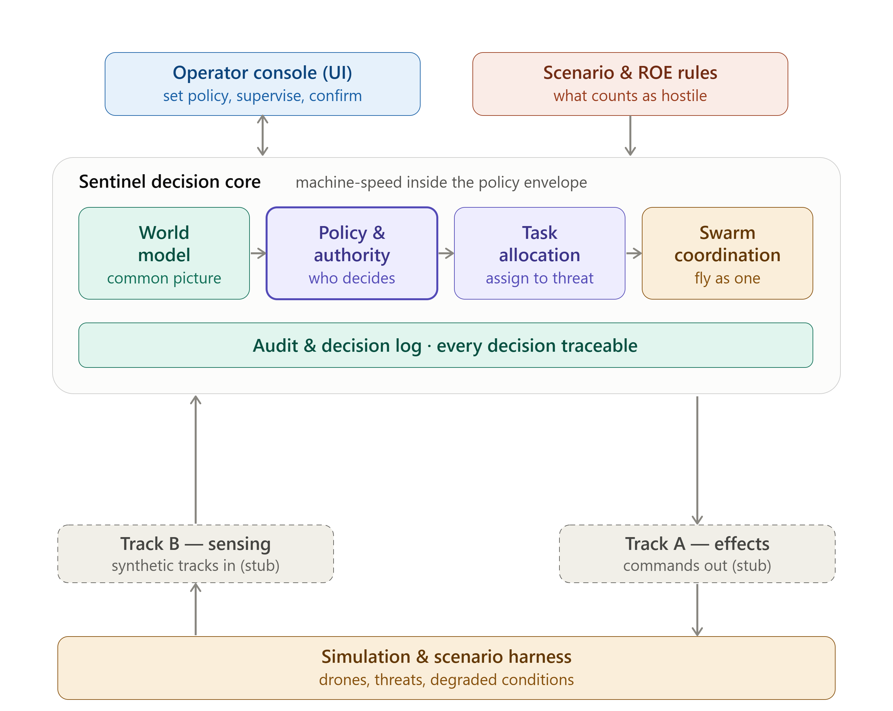

# Sentinel
 
Policy first command and control for autonomous drone swarms. One operator, many drones, human judgement kept in command.
 
Built for the Singapore Defence Tech Hackathon 2026, Track C (Agentic Command and Control for Rapid Wartime Decision Making).
 
## Overview
 
Sentinel lets a single operator direct a swarm of many drones through intent and standing rules of engagement, rather than flying or tasking each drone by hand. The operator sets the policy and supervises. The system handles the fast decisions inside the boundaries the operator has set, and escalates anything outside those boundaries back to a human.
 
## The idea
 
Manual control does not scale. With one operator per drone, a swarm needs a crowd to run it. Sentinel changes the unit of control from the individual drone to the operator's intent: standing rules define what the system may do on its own, what it must ask a human to approve, and what it must never do. The operator governs the swarm the way a commander governs a unit, by setting intent and rules, not by steering every member.
 
## Goals
 
- One operator governs a swarm that scales from a few drones to thirty or more, with the number of operator interventions staying bounded rather than growing with the swarm.
- The human stays in command. Actions inside the standing rules proceed at speed; anything outside them pauses and asks a person.
- Rules can be revised mid mission, and the change takes effect immediately.
- Every decision is logged with its trigger, the rule applied, the verdict, and any human action, so the whole engagement can be reviewed afterwards.
- Interceptor drones are able to autonomously allocate tasks amongst themselves with the help of swarm coordination
- The command layer degrades gracefully under contested conditions such as lost positioning or disrupted communications.
## Architecture
 

 
Sentinel sits between sensing and effects as a command layer:
 
- **Inputs.** The system consumes sensor tracks describing what is out there (Track B).
- **Sentinel decision core.** The world model builds one shared picture, the policy and authority engine decides what is allowed, task allocation matches drones to threats, and swarm coordination keeps them flying together. Every decision flows into the audit log.
- **Outputs.** The system emits commands to the drones (Track A).
- **Simulation harness.** For now, both edges connect to a simulator that generates drones, threats, and degraded conditions, so the system can be proven safely before any real hardware. The edges use open interfaces so real sensors and drones can be connected later.
The policy and authority engine is the heart of the project. It is what makes the human in command claim real, and every decision it makes is auditable.
 
## Repository structure
 
```
sentinel/
├── docs/               Architecture diagram and reference notes.
└── tests/
```
 
## Tech stack

- **Frontend (Operator Console).** TBC
- **Backend.** Python, TBC
- **Simulation.** A custom kinematic simulator as the primary substrate, with PX4 SITL and Gazebo as a higher fidelity option for later.

## Team
 
| Name | Role |
| --- | --- |
| Jason | Drone Task Allocation and Swarm Coordination (Team Lead & Backend) |
| Fittra | Operator Console (Frontend) |
| Yusuf | World Model and Sensing (Frontend) |
| Chang Yao | Simulation and Scenario (Simulation & Testing) |
| Damien | Authority and Policy (Backend) |
 
## Status
 
Early development, Sprint 1. The current target is a working end to end demonstration in simulation, ready for the August mixer. No production code yet.
