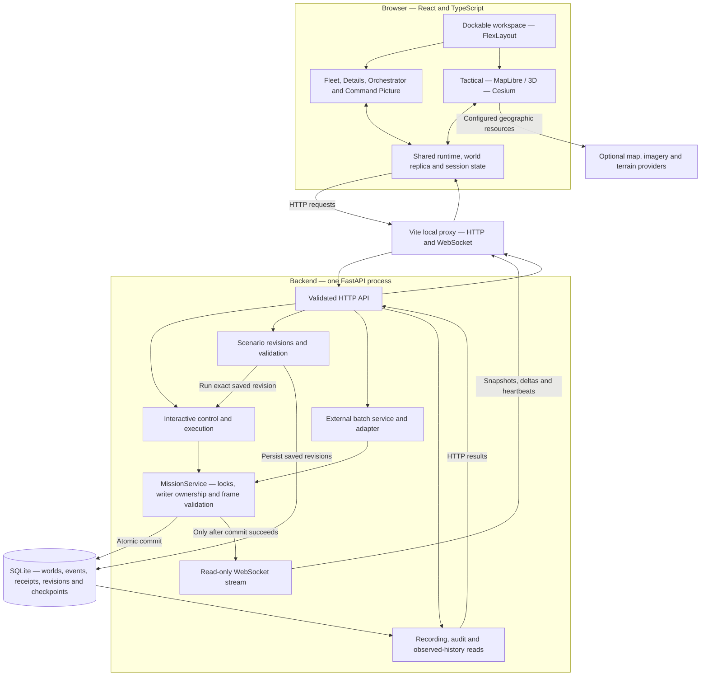
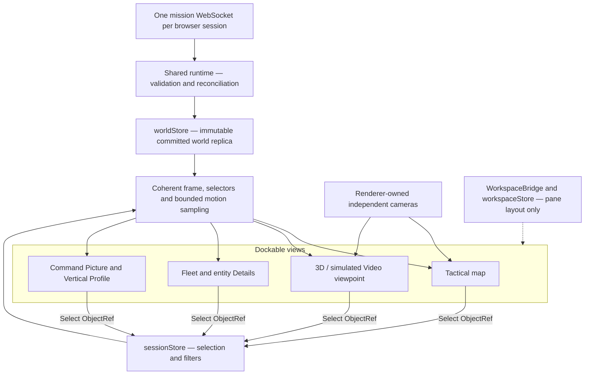
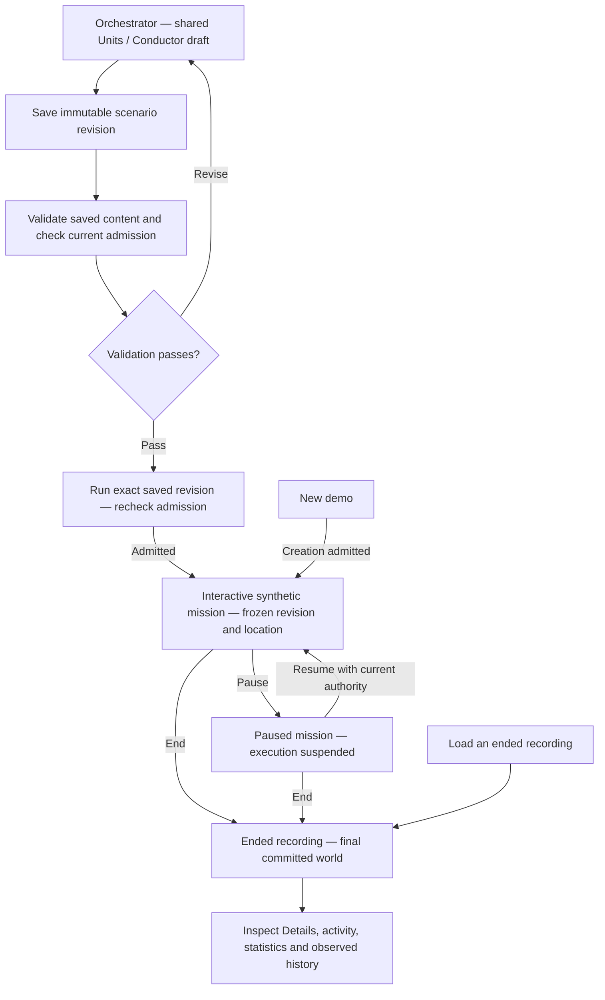
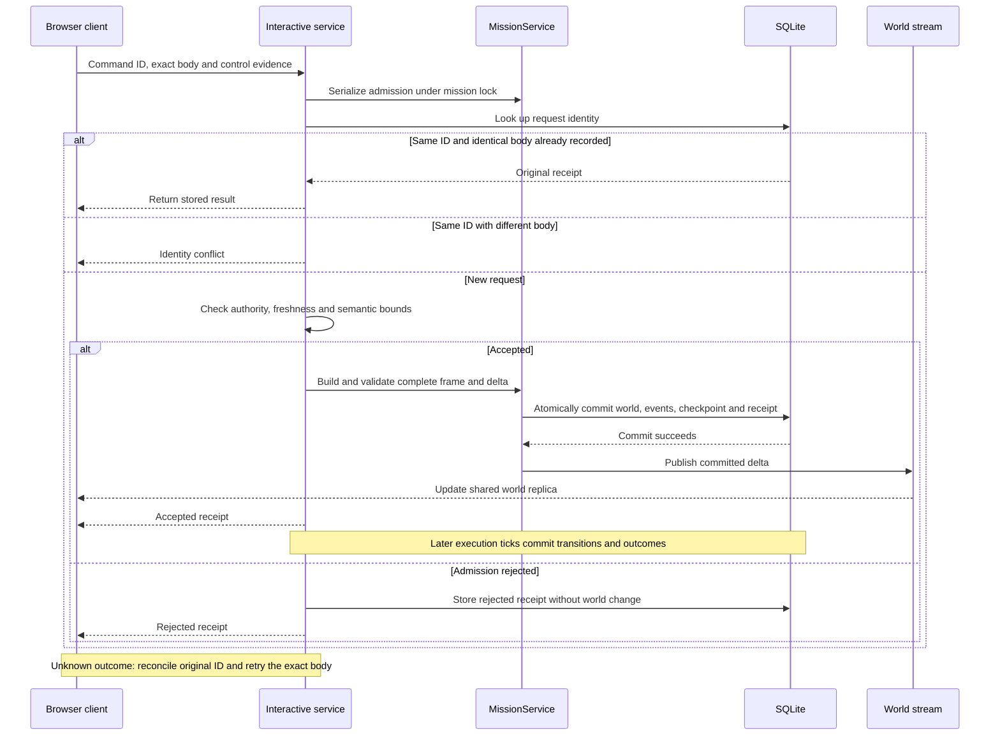
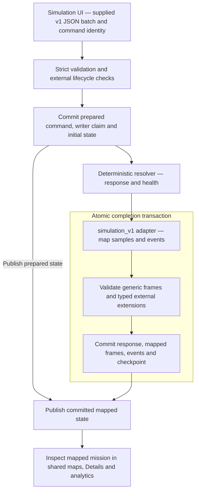

# Sentinel architecture and project structure

Sentinel is a local simulation and mission-inspection workspace. A shared browser runtime connects dockable views to one authoritative backend and its durable recordings.

These diagrams summarize the implementation described in the supplied `README.md` and `architecture.md`. Mermaid support is required to render the diagrams. The project tree is a curated map of documented paths, not a complete repository inventory.

## 1. System architecture



The backend owns mission state; the browser holds a validated replica. Interactive and external missions share recording and presentation infrastructure, but have separate execution ownership. The supported local setup uses frontend port `5180` and backend port `8000` on `127.0.0.1`, with one backend worker per database.

## 2. Shared state across views



Selecting an entity in a map, list or analytic view shares its identity with Details. Map cameras remain independent. Opening another pane reuses the existing runtime and transport. Recorded activity and observed history use separate bounded reads with committed cutoffs; they do not seek mission time.

## 3. Scenario authoring and mission workflow



Editing a draft does not change an existing run. Only one nonterminal interactive run is allowed per database. Ended recordings support inspection; they do not dispatch commands or provide Timeline playback. External simulation uses its own lifecycle, shown below.

## 4. Interactive command and durable publication



An accepted receipt confirms admission, not execution completion. Publication follows a successful database commit. Failures before the receipt boundary are not necessarily durable audit entries.

## 5. External simulation integration



External lifecycle commands are `START`, `HOLD`, `RESUME` and `ABORT`. This is batch integration, with no interactive-executor bridge or continuous external feed. Mapping preserves original identities, timestamps and altitude provenance; it does not infer Assets, Sensors, Tasks or control authority from affiliation. External compatibility remains provisional in the supplied architecture.

## 6. Project structure

This tree includes principal paths explicitly documented in the two source files. Descriptions summarize responsibility; omitted files and folders are not implied to be absent.

```text
Sentinel3/
├── README.md                          # Setup, operation and verification
├── frontend/
│   ├── package.json                   # Frontend dependencies and commands
│   ├── package-lock.json              # Locked npm dependency resolution
│   ├── vite.config.ts                 # Development server, proxy and assets
│   ├── playwright.config.ts           # Browser-test configuration
│   ├── .env.example                   # Configuration template
│   ├── .env.local                     # Local browser-visible configuration
│   ├── src/
│   │   ├── main.tsx                   # React entry point
│   │   ├── app/
│   │   │   ├── runtime.ts             # Shared mission runtime and clients
│   │   │   ├── OperationalContext.tsx # Pane subscriptions and visibility
│   │   │   └── moduleRegistry.ts       # Navigation capabilities
│   │   ├── state/                    # Zustand stores
│   │   │   ├── worldStore.ts          # Immutable world replica
│   │   │   ├── sessionStore.ts        # Selection, filters and intent
│   │   │   └── workspaceStore.ts      # Pane and layout metadata
│   │   ├── world/                    # Reduction, selectors, motion, history
│   │   ├── contracts/                # Contract decoding and integrity
│   │   ├── services/                 # Interactive, scenario and audit clients
│   │   ├── features/
│   │   │   ├── workspace/            # FlexLayout bridge and pane hosts
│   │   │   ├── mission/              # Mission loading and lifecycle controls
│   │   │   ├── entities/             # Fleet, Tracks, Details and selection
│   │   │   ├── orchestrator/         # Shared Units / Conductor authoring
│   │   │   ├── analytics/            # Command Picture, ECharts and Profile
│   │   │   └── credits/              # Attribution and notices
│   │   ├── renderers/
│   │   │   ├── rendererPool.ts        # Renderer ownership and retention
│   │   │   ├── scene.ts               # Shared presentation to renderer input
│   │   │   ├── camera.ts              # Independent camera bookmarks
│   │   │   ├── providers.ts           # Tactical map-provider configuration
│   │   │   ├── maplibre/              # Tactical renderer
│   │   │   └── cesium/                # 3D and simulated viewpoint renderer
│   │   └── modules/
│   │       └── simulation/            # External contract, client and result UI
│   ├── scripts/
│   │   └── generate-contracts.mjs      # Generate frontend contract types
│   └── tests/                         # Unit, browser and performance harnesses
├── backend/
│   ├── requirements-dev.txt           # Pinned direct Python dependencies
│   ├── pyproject.toml                 # Backend project/test configuration
│   ├── app/
│   │   ├── main.py                    # FastAPI startup, services and recovery
│   │   ├── api/                       # HTTP and read-only WebSocket routes
│   │   ├── domain/                    # Models, identities and capacity rules
│   │   ├── missions/
│   │   │   └── service.py             # Mission locks and authoritative commits
│   │   ├── world/
│   │   │   └── serialization.py       # Canonical serialization and strict reads
│   │   ├── commands/                  # Admission, execution and Fleet behavior
│   │   ├── scenarios/                 # Saved revisions, admission and analysis
│   │   ├── recording/                 # Persistence and recording queries
│   │   │   ├── sqlite_repository.py   # SQLite transaction owner
│   │   │   ├── storage_codec.py       # Lossless recording envelopes
│   │   │   ├── history.py             # Bounded observed-history reads
│   │   │   ├── observation_cache.py   # Validated historical projections
│   │   │   └── analytics.py           # Audit and statistics queries
│   │   ├── simulation/                # External validation, lifecycle, resolver
│   │   └── adapters/
│   │       └── simulation_v1/
│   │           └── projection.py     # External results to generic world state
│   ├── data/
│   │   └── sentinel.sqlite3           # Default local database, created at runtime
│   ├── drafts/                        # Retained foundation inputs
│   └── tests/                         # Contract, execution and recovery tests
├── contracts/
│   ├── sentinel/                      # Versioned Sentinel schemas and fixtures
│   └── simulation/                    # Frozen external schemas and decisions
├── scripts/
│   ├── export_contracts.py            # Export backend contract definitions
│   ├── verify_phase0.py               # Foundation verification
│   └── check_repository.py            # Repository hygiene checks
├── docs/
│   ├── README.md                      # Documentation index
│   ├── architecture.md                # Canonical architecture and review ledger
│   ├── demo-runbook.md                # Operator workflows and recovery
│   ├── MAP_SERVICES_SETUP.md          # Hosted map/3D provider setup
│   ├── MAP_REFINEMENT_SETUP.md        # Regional map-pack setup
│   ├── ARCHIVE.md                     # Evidence archive conventions
│   ├── scenario-location/             # Frozen location and geometry contracts
│   ├── phase5-simulation-compatibility/ # External integration documentation
│   ├── phase6-command-picture/        # Analytics definitions and delivery status
│   ├── integrated-acceptance/         # Integration and recovery evidence
│   ├── d7-details-closure/            # Compatibility and performance evidence
│   └── maintenance/                   # Cleanup and documentation ledgers
└── research-brain/                    # Separate research; outside runtime
```
