# Sentinel v3 — Diagrams and project structure

Visual companion to the [architecture blueprint](architecture.md) and the [root README](../README.md).
Every diagram below is plain Mermaid inside a fenced block: copy the block, paste it into any
Markdown file, and GitHub or any Mermaid-aware renderer will draw it.

**What Sentinel is.** A local, single-authority mission workspace for synthetic scenarios. The
backend owns authoritative simulation state and durable recordings; the browser owns inspection,
command *requests* and presentation. It is a simulation and development application — not a
deployed command system, not a real sensor feed, and not certified for multi-user exposure.

**Scope note.** Constants shown in these diagrams are read from source, not from prose. The
[Appendix](#appendix--constants-and-where-they-live) lists each one with its defining file. A
diagram records the implementation and its boundaries; it does not certify performance or
conformance. Open findings live in [architecture.md §11](architecture.md).

---

## Contents

| # | Diagram | Answers |
|---|---|---|
| 1 | [System context](#1-system-context) | What are the pieces and what crosses between them? |
| 2 | [Repository structure](#2-repository-structure) | Where does anything live? |
| 3 | [Backend module map](#3-backend-module-map) | How is the authority layered? |
| 4 | [Frontend module map](#4-frontend-module-map) | How is the browser app layered? |
| 5 | [Lifecycles](#5-lifecycles) | What states can a run and an external command be in? |
| 6 | [Interactive command flow](#6-interactive-command-flow) | How does a command become accepted work? |
| 7 | [External batch flow](#7-external-simulation-batch-flow) | How does a supplied JSON batch become a mission? |
| 8 | [Publication and recovery](#8-frame-publication-streaming-and-recovery) | How does the browser stay in sync? |
| 9 | [The three clocks](#9-the-three-clocks) | Why is there more than one notion of time? |
| 10 | [Contracts and versioning](#10-contract-generation-and-versioning) | How do the two sides stay in agreement? |
| 11 | [Persistence model](#11-persistence-model) | What is actually stored, and how is it keyed? |
| 12 | [Bounds and caches](#12-bounds-and-caches-at-a-glance) | What is capped, and what is not? |
| 13 | [Verification pipeline](#13-verification-pipeline) | What proves a change is safe? |

---

## 1. System context

One browser session talks to one backend process over loopback. The WebSocket is
**server-to-client only** — every mutation travels as an ordinary HTTP request.

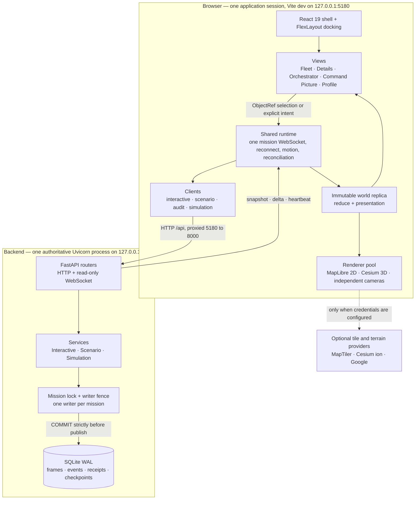

**Ports.** Dev `5180`, preview `5181`, verification preview `5182`, backend `8000`. Vite proxies
`/api` HTTP and WebSocket traffic to `8000`; `SENTINEL_API_TARGET` overrides that target. The
browser test harness additionally owns `8011`.

**Boundary.** There is no production ingress, TLS termination, caller authentication or
multi-worker coordination here. One backend process owns one database.

---

## 2. Repository structure

```
Sentinel3/
├── backend/                          FastAPI authority — owns world state and recordings
│   ├── app/
│   │   ├── main.py                     App construction, router wiring, 0.2 s source loop, recovery
│   │   ├── api/                        HTTP and WebSocket boundary
│   │   │   ├── missions.py               /api          catalog, world frame, events, observed history
│   │   │   ├── stream.py                 /api/missions/…/stream   server-to-client WebSocket
│   │   │   ├── interactive.py            /api/interactive         runs, intents, commands, moves
│   │   │   ├── scenarios.py              /api/scenarios           definitions, revisions, validate
│   │   │   ├── simulation.py             /api/simulation/v1       external batch lifecycle
│   │   │   └── analytics.py              /api          read-only audit query
│   │   ├── domain/                     models.py · base.py · capacity.py  (40 units / 32 controlled)
│   │   ├── world/                      Strict frame readers and canonical serialization
│   │   ├── missions/                   Mission locks, writer fencing, subscriber queues, fixtures
│   │   ├── commands/                   Interactive executor — largest subsystem
│   │   │   ├── service.py policy.py contracts.py errors.py
│   │   │   ├── movement.py kinematics.py scheduler.py behaviors.py engagements.py
│   │   │   ├── selected_control.py recommendations.py zone_rules.py unit_profiles.py
│   │   │   └── legacy_*.py               Retained readers for existing recordings
│   │   ├── scenarios/                  Revisions, geometry, boundaries, frozen location, analysis
│   │   ├── recording/                  SQLite authority, storage codec, history, audit
│   │   ├── simulation/                 External validation, resolver, calibration, journal
│   │   └── adapters/simulation_v1/     External payloads to generic world projection
│   ├── tests/                        29 test modules plus conftest, fixtures and probes
│   ├── data/                         Local SQLite recordings (ignored, not disposable)
│   ├── drafts/                       Foundation inputs still consumed by verify_phase0
│   ├── pyproject.toml
│   └── requirements-dev.txt          Pinned direct Python dependencies
│
├── frontend/                         React 19 + TypeScript 6 + Vite 8 workbench
│   ├── src/
│   │   ├── main.tsx
│   │   ├── app/                        App.tsx · runtime.ts · OperationalContext.tsx
│   │   │                               moduleRegistry.ts · WallClock.tsx
│   │   ├── state/                      Zustand stores
│   │   │   ├── worldStore.ts             Immutable live replica and connection status
│   │   │   ├── sessionStore.ts           ObjectRef selection, filters, time mode
│   │   │   ├── workspaceStore.ts         Pane layout only — written solely by WorkspaceBridge
│   │   │   └── displayPreferences.ts
│   │   ├── world/                      26 pure modules: reduce · presentation · entityRows
│   │   │                               motionPresentation · observedHistory · historyCache
│   │   │                               geometry · scenarioDraft · scriptPlan · time
│   │   ├── services/                   api · interactiveClient · scenarioClient · auditClient
│   │   │                               worldStream · recommendationClient · liveBoundaryEditor
│   │   ├── contracts/                  generated.ts + decode.ts · integrity.ts  (AJV validation)
│   │   ├── features/
│   │   │   ├── workspace/                WorkspaceHost · PaneHost · workspaceBridge · viewRegistry
│   │   │   ├── entities/                 Fleet · Tracks · Details · selection  (19 files)
│   │   │   ├── analytics/                Command Picture · Vertical Profile · one ECharts host
│   │   │   ├── orchestrator/             Units + Conductor wrapper over one scenario client
│   │   │   ├── units/                    Unit editor, placement, boundaries, scenario location
│   │   │   ├── conductor/                Scenario run review
│   │   │   └── map/ cockpit/ mission/ movement/ settings/ credits/
│   │   ├── renderers/
│   │   │   ├── rendererPool.ts           4 live · 2 hidden · 120 s TTL · 512 MiB budget
│   │   │   ├── maplibre/                 Tactical 2D adapter, PMTiles, regional style
│   │   │   ├── cesium/                   Ordinary 3D, simulated cockpit and Video overlay
│   │   │   └── scene · camera · symbology · unitGlyphs · labelLayout · providers
│   │   ├── modules/simulation/         Typed external contract UI, kept out of generic world
│   │   ├── assets/units/               Bundled images for explicit supported profiles only
│   │   └── styles/
│   ├── tests/                        unit · browser · performance · fixtures · harness
│   │                                 plus phase suites mirroring docs/
│   ├── scripts/                      generate-contracts · build-test-bundles · setup-local-maps
│   ├── vite.config.ts                Ports and /api HTTP + WS proxy
│   ├── playwright.config.ts
│   └── package.json                  Lockfile-pinned resolution
│
├── contracts/                        The seam between the two halves
│   ├── sentinel/                     v1 … v1.16 frozen packages; current export is v1.16
│   │   └── v1.16/                      world · stream · interactive · scenarios · analytics
│   │                                   simulation-module · openapi · world fixtures
│   └── simulation/                   Frozen external v1 request/response schemas
│       ├── fixtures/                   Golden request/response pair, manifest, 18 negative cases
│       └── compatibility-decisions.md  Unresolved organizer interpretations
│
├── docs/
│   ├── architecture.md               Canonical blueprint — start here
│   ├── demo-runbook.md               Operation, selection and recovery workflows
│   ├── DIAGRAMS.md                   This file
│   ├── ARCHIVE.md                    SHA-256 archive and readback convention
│   ├── MAP_SERVICES_SETUP.md · MAP_REFINEMENT_SETUP.md
│   ├── phase5-simulation-compatibility/   External contract delivery and critiques
│   ├── phase6-command-picture/            Analytics delivery; METRICS.md is authoritative
│   ├── d7-details-closure/                Details, provider and pacing closure
│   ├── integrated-acceptance/ orchestrator-ui/ scenario-location/ performance-closure/
│   ├── repository-cleanup/ reports/
│   └── maintenance/                  Cleanup and documentation ledgers with file hashes
│
├── scripts/                          export_contracts · verify_phase0 · check_repository
│                                     performance and recording diagnostics
├── research-brain/                   Separate Obsidian vault — outside the runtime
└── README.md                         Install, start, use, verify
```

> **Housekeeping note.** A stray `backend/backend/data/sentinel.sqlite3` exists in the working
> tree — the shape a run started from the wrong working directory leaves behind. It is ignored by
> git and is not referenced by `main.py`, which resolves the default database to
> `backend/data/sentinel.sqlite3`. Confirm it holds nothing you want before removing it.

---

## 3. Backend module map

Layered by domain rather than by technical role. Every write path funnels through `MissionService`
and the single-connection repository.

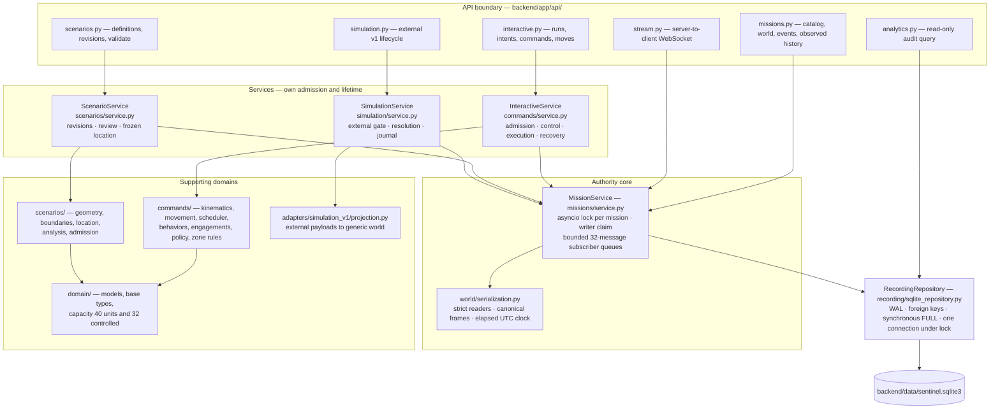

**Source loop.** `main.py` runs one task that advances a fixed **0.2 s of source time per running
tick**, then sleeps the remaining wall-time cadence. There are no catch-up bursts, so slow work
shows up as source-clock drift rather than as a time jump.

---

## 4. Frontend module map

One runtime, one mission transport, one chart library. Opening another pane does **not** open
another mission connection.

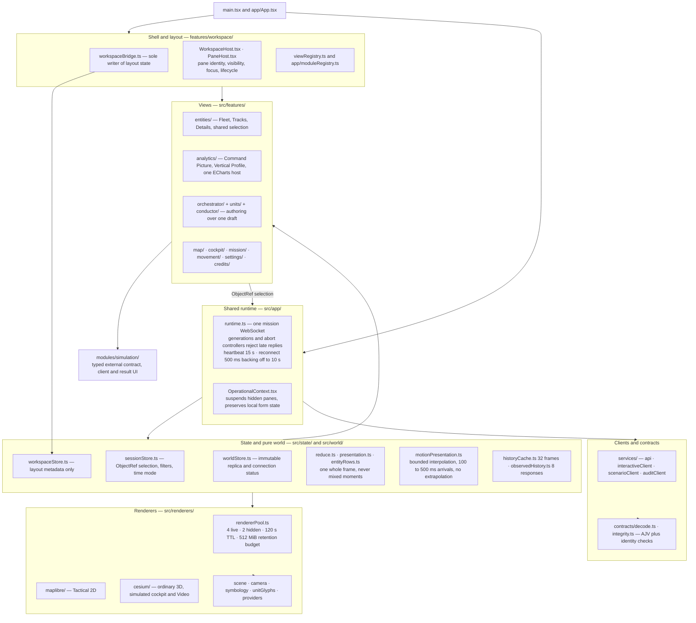

**Ownership rules worth knowing before you add a view.** Cameras belong to renderers, not to
selection. No world, command authority or GPU object belongs in layout state. Hiding a pane
suspends its subscriptions but does not pause the simulation.

---

## 5. Lifecycles

### Interactive run state

`RunState` is exactly `ready · running · paused · ended` (`commands/contracts.py`).

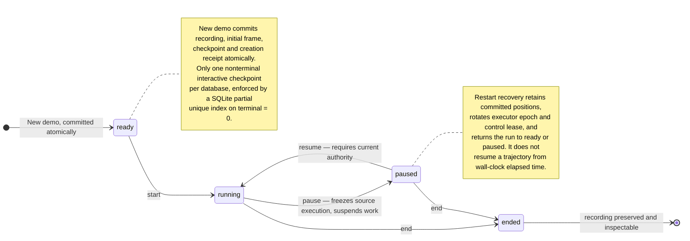

**Stop is not a state.** `stop` is a nonpositional control with its own freshness and admission
checks — it halts supported unit activity, it does not rewind and it does not end the run. Ending
finalises the run; loading it afterwards gives inspection, never command dispatch.

### External command state

`simulation_commands.state` is constrained by CHECK to exactly three values.

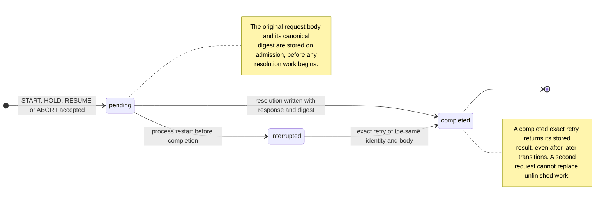

External runs additionally report `RUNNING · HELD · ABORTED · FAILED`, which is the supplied
contract's own lifecycle — separate from the interactive Start/Pause/End above. The two executors
never join.

---

## 6. Interactive command flow

The point of this diagram: **request identity is the safety mechanism.** The same ID with the same
body is idempotent; the same ID with different content is a conflict.

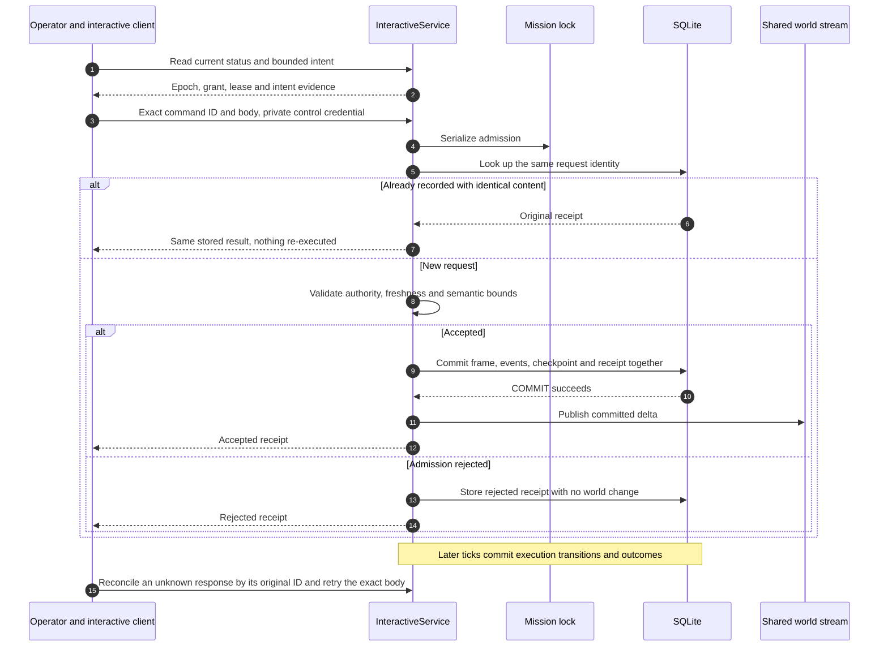

**What a receipt is and is not.** A receipt proves the request was admitted and durably recorded.
It is not proof of physical completion. Accepted execution is deliberately *not* cancelled merely
because the admitting lease expires or its pane closes.

---

## 7. External simulation batch flow

Two transactions, both committed before anything is published. The resolver stays pure; the
adapter owns all mapping into generic world objects.

```mermaid
sequenceDiagram
  autonumber
  participant UI as Simulation client
  participant S as SimulationService
  participant R as Pure resolver and adapter
  participant DB as Shared SQLite owner
  participant W as Existing world runtime

  UI->>S: Original external body and command identity
  S->>S: Strict parse, complete validation and lifecycle checks

  rect rgb(238, 243, 249)
    Note over S,DB: Transaction 1 — claim and acknowledge
    S->>DB: Prepared command, writer claim, run and receipt event or frame
    DB-->>S: Commit
  end
  S->>W: Publish prepared state

  S->>R: Cooperative deterministic resolution
  R-->>S: Response and health

  rect rgb(238, 243, 249)
    Note over S,DB: Transaction 2 — resolve and record
    S->>R: Map samples and events, validate and serialize inside the transaction
    R-->>S: Validated mapped frames and events
    S->>DB: Response plus all frames, events and checkpoint
    DB-->>S: Commit
  end
  S->>W: Publish completed mapped state
  S-->>UI: Stored response and acknowledgement

  Note over UI,DB: A lost response retries the exact identity and body;<br/>a completed retry returns the original result
```

**Boundaries.** The adapter produces generic Entities and Tracks plus typed
`sentinel.simulation.v1` extensions — external Assets, Sensors and Tasks are left empty rather than
invented. Original MSL altitudes, calibration evidence and health survive the mapping. The final
full-batch commit is **synchronous** and can block other source work; that is a known open finding,
not a design goal.

---

## 8. Frame publication, streaming and recovery

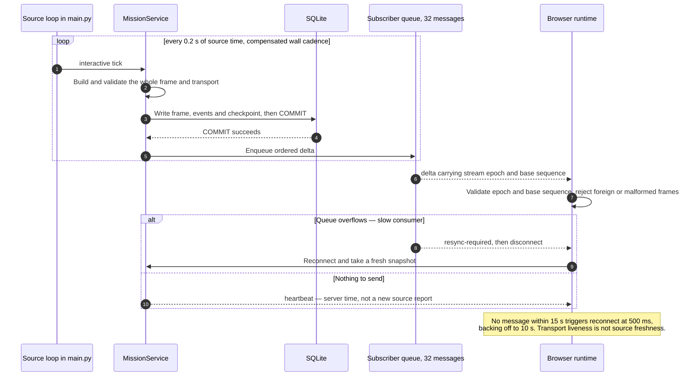

**Three failure modes, three different signals.**

| Situation | What the system does | What it never does |
|---|---|---|
| Slow browser consumer | Queue fills, asks for resync, disconnects | Silently drop changes |
| Source report older than 2 s | Labels the source *delayed*, gates positional actions | Treat a paused source as stalled |
| SQLite write fails | Publication is prevented, last committed view stays available | Fabricate an observation |

Motion is sampled only between **committed** positions. Stale data is held at its last committed
position — there is no extrapolation.

---

## 9. The three clocks

Conflating these is the most common way to misread Sentinel's data.

```mermaid
flowchart LR
  subgraph SRC["Source / effective time"]
    S1["Observation and sample time; frame effectiveAt"]
    S2["Interactive ticks advance it by exactly 200 ms"]
    S3["External batches supply their own sample times<br/>and can record corrections"]
  end

  subgraph REC["Recording / ingestion time"]
    R1["Backend recordedAt; command received and completed"]
    R2["Clamped nondecreasing at commit"]
    R3["Audit buckets use this clock"]
  end

  subgraph PRE["Presentation time"]
    P1["Browser monotonic animation clock"]
    P2["Bounded interpolation between committed positions"]
    P3["Writes no observation and no recording"]
  end

  SRC -- "durably ordered as" --> REC
  REC -- "sampled for display as" --> PRE
```

| Clock | Used by | Trap |
|---|---|---|
| Source / effective | Observed-history windows, frame `effectiveAt` | Source time is never relabelled as recording time |
| Recording / ingestion | Audit buckets, durable ordering, receipts | Fixed-step drift is not a transport outage |
| Presentation | Maps, cockpit, current Profile markers | Interpolated positions are not committed observations |

Wire UTC is strict millisecond `YYYY-MM-DDTHH:mm:ss.SSSZ` with calendar validation. SGT formatting
is display-only.

---

## 10. Contract generation and versioning

Python models are the authority. Frontend types are generated, never hand-edited.

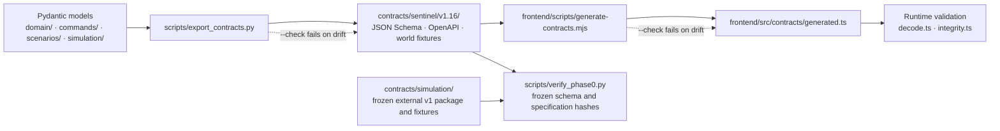

**Version numbers name different things.** This trips people up constantly:

| Number | What it versions |
|---|---|
| **v1.16** | The current *export package* — it does not stamp every message |
| **1.10 / 1.11** | Current world frames; 1.11 when frozen local geometry is present |
| **1.6** | Scenario content readers for supplied location geometry |
| **4 / 5 / 6** | SQLite storage versions — 5 on first compressed write, 6 on first external preparation |
| **1.10.0** | The FastAPI application version string, unrelated to the above |

Frozen prior packages are immutable verification inputs. Never rewrite one to make a new
implementation pass.

---

## 11. Persistence model

One SQLite database, WAL mode, foreign keys on, `synchronous=FULL`, a single connection under its
own lock. Relationships below are the declared schema, not an idealised model.

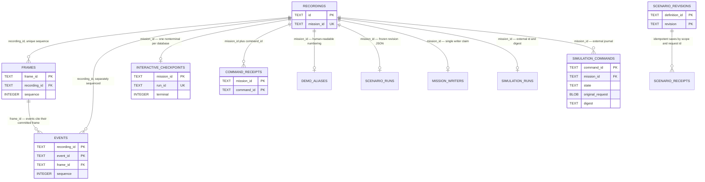

**Standalone tables.** `creation_receipts` (keyed by `creation_id`), `scenario_revisions`,
`scenario_receipts` and `simulation_profiles` (keyed by `profile_id` + `version`) carry no foreign
key to `recordings` — they are identity and content stores, not per-recording rows.

**Retention is not capped.** `End` stops interactive execution, not historical retention. There is
no automatic pruning, no backup/restore product and no replication. Back up with a SQLite-aware
process; do not copy a live main file alone, and never attach a second writer to operator data.

---

## 12. Bounds and caches at a glance

Each cap is real; each right-hand column is the part people wrongly assume is also capped.

| Bound | Value | What it does **not** bound |
|---|---|---|
| Observed-history response | 5–300 s window, 1 000 frames, 2 000 newest points | SQL ranking before LIMIT, cold validation cost, total recording size |
| Selected-frame projection cache | 1 000 entries / 16 MiB | Database payload size; unknown data still needs full validation |
| Committed validation proofs | 1 000 fingerprints, installed only after COMMIT | Validation of merely similar content |
| Browser observed history | 8 responses | Unlimited time-series browsing; an aborted read still costs the server |
| Profile live refresh | at most once per second | Sample decimation — each read still retains all in-window observations |
| Audit query | ≤ 24 h range, ≤ 100 rows per page (UI 50), ≤ 20 000 summary rows | Underlying scan, sort, JSON filter and count work; cancelling SQL mid-statement |
| Saved scenario analysis | 8 entries / 2 MiB | Cold nominal execution time |
| Historical whole-frame cache | 32 frames | Timeline playback — not implemented |
| Current analytic cache | one frame/filter result | CPU cost of projecting a large frame on a miss |
| Subscriber queue | 32 messages, then resync and disconnect | Server-side publication rate |
| Renderer pool | 4 live, 2 hidden, 120 s TTL, 512 MiB accounting | Actual browser or GPU memory — this is retention policy, not a hard cap |
| Scenario capacity | 40 units, at most 32 controlled actors | Rendering or analytic performance at that size |
| Storage codec | 16 MiB decoded bound on **binary** envelopes | Legacy or larger TEXT payloads, which have no equivalent cap |

Pagination is not evidence of constant query cost. Cold observed-history validation has been
measured in the seconds on a retained probe.

---

## 13. Verification pipeline

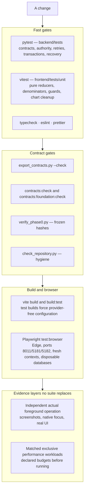

Full command invocations live in the [root README](../README.md); harness details, port ownership
and isolated output suffixes live in [frontend/tests/README.md](../frontend/tests/README.md).

**Never** attach a second writer to operator data, clear operator storage, or treat a passing
subset as a substitute for the complete browser gate when application code changes.

---

## Appendix — constants and where they live

Verified by reading source, not documentation.

| Constant | Value | Defined in |
|---|---|---|
| Source tick cadence | `0.2` s, compensated, no catch-up | [`backend/app/main.py:50`](../backend/app/main.py#L50) |
| Server heartbeat interval | `5` s default | [`backend/app/main.py:25`](../backend/app/main.py#L25) |
| Subscriber queue depth | `32` messages | [`backend/app/missions/service.py:24`](../backend/app/missions/service.py#L24) |
| Client heartbeat deadline | `15_000` ms | [`frontend/src/app/runtime.ts:134`](../frontend/src/app/runtime.ts#L134) |
| Request timeout | `10_000` ms | [`frontend/src/app/runtime.ts:135`](../frontend/src/app/runtime.ts#L135) |
| Reconnect delay and cap | `500` ms, backing off to `10_000` ms | [`runtime.ts:136`](../frontend/src/app/runtime.ts#L136), [`:335`](../frontend/src/app/runtime.ts#L335) |
| Scenario capacity | `MAX_SCENARIO_UNITS = 40`, `MAX_CONTROLLED_UNITS = 32` | [`backend/app/domain/capacity.py:2`](../backend/app/domain/capacity.py#L2) |
| Observed-history caps | `MAX_FRAMES = 1000`, `MAX_POINTS = 2000`, window `5`–`300` s | [`backend/app/recording/history.py:19`](../backend/app/recording/history.py#L19) |
| Observation cache | `1000` entries, `16` MiB, `1000` committed proofs | [`backend/app/recording/observation_cache.py:22`](../backend/app/recording/observation_cache.py#L22) |
| Audit bounds | `20000` summary rows, page `50` default / `100` max, `24` h range | [`backend/app/recording/analytics.py:19`](../backend/app/recording/analytics.py#L19) |
| Renderer pool | `maxAlive 4`, `maxHidden 2`, `120_000` ms TTL, `512` MiB | [`frontend/src/renderers/rendererPool.ts:24`](../frontend/src/renderers/rendererPool.ts#L24) |
| Historical frame cache | `capacity = 32` | [`frontend/src/world/historyCache.ts:5`](../frontend/src/world/historyCache.ts#L5) |
| Run states | `ready · running · paused · ended` | [`backend/app/commands/contracts.py:18`](../backend/app/commands/contracts.py#L18) |
| Execution states | `Accepted · Running · Suspended · Completed · Cancelled · Failed · Expired · Interrupted` | [`backend/app/commands/contracts.py:164`](../backend/app/commands/contracts.py#L164) |
| External actions and states | `START · HOLD · RESUME · ABORT`; `RUNNING · HELD · ABORTED · FAILED` | [`backend/app/simulation/contracts.py:53`](../backend/app/simulation/contracts.py#L53) |
| External command persistence | `pending · interrupted · completed` | [`backend/app/simulation/repository.py:30`](../backend/app/simulation/repository.py#L30) |
| WebSocket route | `/api/missions/…/stream` | [`backend/app/api/stream.py:12`](../backend/app/api/stream.py#L12) |
| SQLite tables | 14 across core and external schema | [`sqlite_repository.py`](../backend/app/recording/sqlite_repository.py), [`simulation/repository.py`](../backend/app/simulation/repository.py) |
