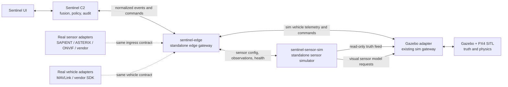
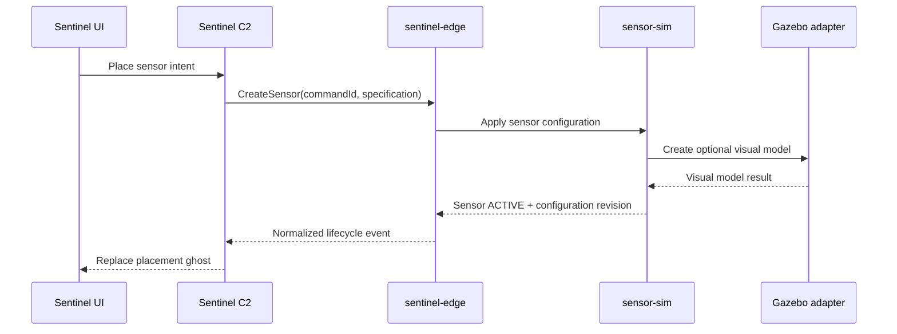
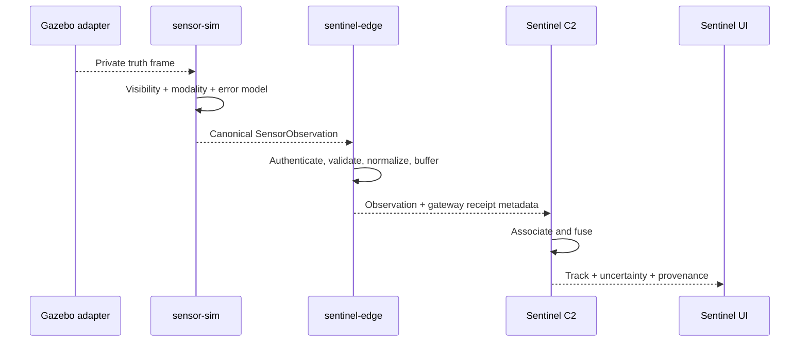

# Sentinel edge gateway and standalone sensor simulator

Status: implementation in progress; edge, multimodal sensor-sim, map placement,
Gazebo visual lifecycle, analytic fusion, and NDJSON record/replay implemented
Date: 27 July 2026
Scope: simulate the inputs that real sensors and drones will later send through
an edge gateway, without coupling Sentinel UI to Gazebo or simulation code.

## Decision

Build `sentinel-sensor-sim` as a separate executable/service. It must not run
inside the Sentinel UI, C2 server, or Gazebo process.

Build `sentinel-edge` as a separate executable/service. Sentinel C2 connects to
this gateway in simulation, replay, bench, and live modes. Replacing a
simulated producer with a real adapter must not change the C2 domain types or
the operator UI.

Gazebo remains a separate world/physics simulator. It exposes truth only to
simulation components. Gazebo truth must never be accepted by the normal
Sentinel observation or track path.

## Runtime topology



The sensor simulator may read truth from the Gazebo adapter, but the edge
gateway does not forward that truth to C2. This makes accidental truth leakage
structurally harder.

## Responsibilities

### Sentinel UI

- Sensor placement and configuration workflow.
- Display gateway/device health, raw observations, fused tracks, provenance,
  latency, uncertainty, and `SIMULATED`/`REPLAY`/`LIVE` source badges.
- No direct connection to Gazebo, the sensor simulator, or physical devices.

### Sentinel C2

- Operational state, fusion, association, policy, tasking, and audit.
- Converts operator intent into gateway commands.
- Consumes only normalized observations and vehicle telemetry from
  `sentinel-edge`.

### `sentinel-edge`

- Authenticates producer/adapter identities.
- Maintains the sensor and vehicle registry.
- Validates schema version, timestamps, coordinate frames, units, sequence
  numbers, configuration revisions, and message size.
- Normalizes vendor/simulator messages into canonical contracts.
- Applies bounded queues, rate limits, freshness, backpressure, reconnect, and
  dead-letter handling.
- Routes allow-listed, idempotent commands to the correct adapter.
- Publishes health and metrics independently from observation data.
- Persists a short store-and-forward buffer and audit metadata; it is not the
  long-term mission database.

### `sentinel-sensor-sim`

- Owns simulated sensor instances and modality models.
- Consumes a read-only Gazebo truth snapshot/stream.
- Applies field of view, line of sight, detection probability, noise, bias,
  latency, false alarms, packet loss, clock error, and deterministic faults.
- Emits radar, RF, EO/IR, and acoustic measurements in the same canonical
  envelope used by real adapters.
- Stores `truthEntityId` only in an isolated debug record; it never puts that
  identifier in the gateway ingress message.
- Supports fixed seeds, record/replay, pause, step, and accelerated time.
- Requests optional visual models from the Gazebo adapter. Gazebo visuals are
  presentation aids and are not sensor state.

### Gazebo adapter

- Owns the existing Gazebo/PX4 connection, world entity lifecycle, truth
  stream, and simulated vehicle command translation.
- Exposes the truth feed only on a simulation-only endpoint or network.
- Publishes PX4/SITL vehicle telemetry to `sentinel-edge` through the simulated
  vehicle adapter.

## Control and data paths

### Place a simulated sensor



The command is complete when the sensor simulator acknowledges its active
configuration. A failed Gazebo visual model may be reported as a warning; it
must not silently change the measurement configuration.

### Produce an observation



## External contracts

Use one logical producer API regardless of transport:

```ts
interface EdgeProducer {
  registerSource(request: RegisterSource): Promise<Registration>
  publishObservations(batch: SensorObservation[]): Promise<PublishAck>
  publishVehicleStates(batch: VehicleState[]): Promise<PublishAck>
  publishHealth(health: SourceHealth): Promise<PublishAck>
  receiveCommands(): AsyncIterable<EdgeCommand>
  acknowledgeCommand(ack: CommandAck): Promise<void>
}
```

For the MVP:

- Protobuf definitions are the source of truth.
- Use gRPC bidirectional streaming between adapters/simulators and
  `sentinel-edge`.
- Expose HTTP snapshot/command endpoints and a WebSocket event stream from
  `sentinel-edge` to Sentinel C2, reusing the current client behavior where
  practical.
- Use a separate RTSP/WebRTC or object-reference path for imagery. Never put
  video frames on the observation event stream.
- Provide an NDJSON adapter for deterministic replay and debugging.

The semantic contract should preserve the public SAPIENT detection concepts,
while allowing modality-specific radar, RF, imagery, acoustic, cooperative-ID,
and vehicle payloads described in `BATTLEFIELD_SENSOR_DATA_RESEARCH.md`.

## Minimum message envelope

Every ingress message requires:

- schema version and message/observation ID
- source, adapter, sensor/device, and configuration-revision IDs
- `SIMULATED`, `REPLAY`, or `LIVE` mode
- monotonic source sequence
- observation and source-send timestamps
- gateway receive timestamp added by `sentinel-edge`
- clock quality and uncertainty
- coordinate frame, units, sensor pose/transform revision
- measurement processing level and covariance/quality
- bounded raw-evidence reference when applicable

The edge gateway rejects or quarantines:

- unknown schema major versions
- unauthenticated sources
- impossible or unknown coordinate frames
- stale configuration revisions
- duplicate IDs with different content
- messages exceeding configured age, rate, or size limits

## Truth isolation

Use separate contracts and preferably separate ports:

| Path | Contract | Consumers |
|---|---|---|
| Gazebo truth | `SimTruthFrame` | `sentinel-sensor-sim`, developer recorder |
| Sensor ingress | `SensorObservation` | `sentinel-edge` |
| Vehicle ingress | `VehicleState` | `sentinel-edge` |
| Operational output | observations, health, telemetry, command acknowledgements | Sentinel C2 |
| Fused output | tracks and provenance | Sentinel UI |

`SimTruthFrame` and `SensorObservation` must live in different schema packages.
Production builds of `sentinel-edge` should not include or accept the truth
schema.

## Deployment modes

| Mode | Producers connected to `sentinel-edge` | Sentinel behavior |
|---|---|---|
| Simulation | sensor-sim + Gazebo/PX4 vehicle adapter | normal UI with `SIMULATED` badges |
| Replay | NDJSON/recording adapter | same UI with `REPLAY` badges |
| Bench/HIL | one real adapter + optional simulated peers | mixed-source badges and provenance |
| Live | real sensor and vehicle adapters | same contracts with `LIVE` badges |

Mixed mode is intentional. It allows one real sensor to be tested against
simulated peers without pretending the entire scenario is live.

## Repository and process split

Recommended deliverables:

```text
sentinel/                 UI and C2
sentinel-edge/            gateway executable, registry, validation, routing
sentinel-sensor-sim/      sensor models, truth client, fault/replay controls
drone-c2-sim/             Gazebo/PX4 and Gazebo adapter
sentinel-contracts/       versioned Protobuf/JSON fixtures and compatibility tests
```

These may begin as sibling packages in one monorepo, but each must build,
configure, start, stop, and fail independently. Do not share a runtime database
or import simulator implementation modules into Sentinel.

## MVP cut

Build the smallest vertical slice in this order:

1. Extract `sentinel-edge` in front of the current simulator connection.
2. Define registration, health, observation, vehicle-state, command, and
   acknowledgement contracts with golden fixtures.
3. Build `sentinel-sensor-sim` with radar and RF models consuming Gazebo truth.
4. Route UI sensor placement through C2 and the edge gateway to sensor-sim.
5. Add deterministic fault injection and NDJSON record/replay.
6. Add EO/IR and acoustic metadata models.
7. Replace one simulated producer with a bench adapter to prove that Sentinel
   does not change.

The MVP is successful when the same Sentinel build can switch between
simulation, replay, and one live/bench adapter using configuration only.

### Implemented vertical slices

- Standalone `sentinel-edge` and `sentinel-sensor-sim` processes.
- Authenticated source registration, health, observation validation, bounded
  buffering, duplicate/sequence checks, and truth-identifier rejection.
- Deterministic radar, RF, EO/IR, and acoustic models consuming the private
  Gazebo state feed.
- Runtime sensor create/update/delete through C2 and the edge gateway.
- Map-click WGS84-to-ENU placement, coverage rendering, orientation updates,
  and static Gazebo visual models.
- C2-side nearest-neighbor association and multimodal evidence fusion. Radar
  establishes position; bearing-only sensors can confirm and classify but
  cannot fabricate range.
- Separate analytic fused-track map layer with tentative, confirmed, and
  coasting lifecycle states; it is not fed into engagement/tasking state.
- Bounded NDJSON observation export plus a deterministic replay producer that
  preserves relative timing and registers with `REPLAY` provenance.
- Shared TypeScript/Protobuf contracts and cross-service tests.

## Acceptance criteria

- Stopping sensor-sim marks its sources stale/degraded but does not stop
  Sentinel, Gazebo, or the edge gateway.
- Stopping Gazebo removes truth updates; sensor-sim emits no perfect frozen
  detections and reports degraded input health.
- Restarting any service reconciles source and sensor snapshots without
  duplicate observations or devices.
- No normal gateway packet contains a Gazebo entity ID or perfect target pose.
- A fixed scenario seed produces a byte-stable observation fixture after
  timestamps are normalized.
- Simulated and live observations pass the same schema and conformance suite.
- Backpressure drops or samples data according to policy and reports the count.
- Commands are authenticated, allow-listed, idempotent, acknowledged, and
  auditable.
