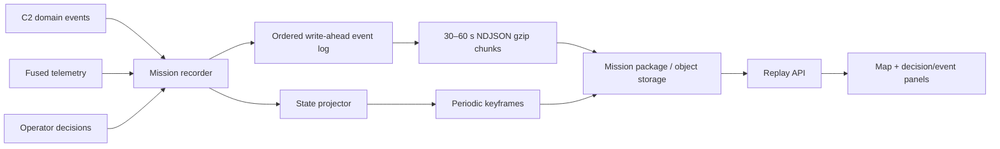

# Sentinel Mission Recording Format

## Objective

Mission recordings must be portable across cloud, edge, and disconnected review stations; seekable without replaying the mission from the beginning; and compact enough for long-running operations.

The recommended format is an append-only event stream plus periodic materialized map keyframes. Events are the audit source of truth. Keyframes are a derived seek index and can be rebuilt.

## Package layout

```text
MSN-0726.sentinel-mission/
  manifest.json
  events/
    000000-000059.ndjson.gz
    000060-000119.ndjson.gz
  keyframes/
    000000.json.gz
    000020.json.gz
    000040.json.gz
  media/
    sha256-<digest>.<extension>
  checksums.sha256
```

- `manifest.json` is small, human-readable, versioned metadata.
- Event chunks are newline-delimited JSON compressed with gzip. NDJSON is streamable and recoverable after a partial write; gzip is widely supported on browsers, servers, and field laptops.
- Chunks cover 30–60 seconds so a reviewer downloads only the required time range.
- Keyframes contain the complete materialized mission/map state every 10–20 seconds and at phase boundaries.
- Large imagery/video stays out of the event stream. Events reference content-addressed media by SHA-256.

## Event envelope

The canonical TypeScript contract is [`contracts/missionRecording.ts`](../contracts/missionRecording.ts).

Every event contains:

- `schemaVersion`, `missionId`, immutable `eventId`, and strictly increasing `sequence`;
- mission-relative monotonic `atMs` for deterministic replay;
- UTC `observedAt` for correlation with external systems;
- category (`decision` or `event`), semantic `type`, severity/tone, entity IDs, and summary;
- an optional typed payload for event-specific data.

Use mission-relative time for playback. Wall-clock timestamps can jump under NTP/GPS correction and should never drive replay ordering.

## What to record

Record domain changes, not rendered pixels or Redux actions:

1. Mission lifecycle and phase changes.
2. Entity lifecycle: spawned, activated, faulted, eliminated, removed.
3. Fused track changes and classification changes.
4. Operator decisions, ROE evaluation result, recommendation inputs, approval/veto, and actor identity.
5. Commands and acknowledgements.
6. Route, assignment, payload, and link-state changes.
7. Telemetry deltas at an adaptive rate.
8. Periodic full state keyframes.

Do not store UI-only state such as open panels, hover state, or map zoom unless it is explicitly needed for training review.

## Efficient telemetry

- Sample moving entities at 2–5 Hz for normal review; retain higher-rate raw flight logs separately when engineering analysis requires them.
- Emit a telemetry event only when position, orientation, or health exceeds a configured delta threshold, plus a heartbeat at least every two seconds.
- Quantize WGS84 coordinates or store local ENU integer millimetres inside telemetry payloads. The manifest carries the origin and coordinate-frame revision.
- Delta-encode values within a chunk. Reset deltas at each keyframe/chunk boundary so corruption remains localized.
- Compress completed chunks asynchronously; never block the command path on archival I/O.

## Recorder architecture



The recorder subscribes to the same domain-event bus used by the C2 state projector. A single mission-scoped sequence allocator orders events. The write-ahead log is fsynced in small batches; a background worker seals and compresses chunks. At mission completion, the manifest and checksums are written last.

## Replay and seeking

To seek to `T`:

1. Load the latest keyframe at or before `T`.
2. Apply events after that keyframe through `T` in sequence order.
3. Interpolate telemetry only for visual motion between recorded samples.
4. Never interpolate lifecycle or decision events. A target disappears exactly when its `track.removed`/`target.eliminated` event is applied.

This provides fast random access, deterministic target removal, and consistent decision/event logs without coupling recordings to a specific simulator.

## Integrity and compatibility

- SHA-256 each sealed chunk and media object; sign the final manifest when evidentiary integrity matters.
- Encrypt packages at rest and keep actor identity/authorization claims in access-controlled fields.
- Readers must ignore unknown event types and payload fields from newer minor schema versions.
- Major schema migrations should be performed by a standalone package converter, preserving original checksums and provenance.
