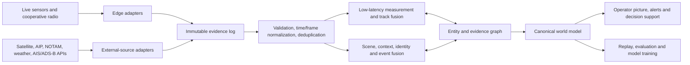

# Sentinel multisource fusion research and target architecture

**Status:** Recommended architecture and implementation roadmap  
**Date:** 2 September 2026  
**Scope:** Public and commercial sources, startup patterns, open-source software,
fusion methods, evaluation, and a practical migration path for Sentinel.  
**Interpretation:** “AIP” means Aeronautical Information Publication.

## 1. Executive recommendation

Sentinel should evolve from a short-lived, radar-seeded track combiner into a
**hybrid probabilistic evidence graph** with two coupled fusion paths:

1. A low-latency tracking path for radar, RF direction finding, EO/IR,
   acoustic, LiDAR, ADS-B, AIS, Remote ID, and vehicle telemetry.
2. An asynchronous intelligence path for satellite scenes/detections,
   AIP/AIXM, NOTAM, weather, terrain, infrastructure, and OSINT-derived events.

The paths should share identity, provenance, space-time, uncertainty, and
source-health primitives, but they should not use one freshness rule or one
measurement schema. Satellite imagery is a scene captured at an earlier time;
AIP is authoritative context rather than a target detection; cooperative radio
reports are claims that may be stale or spoofed; RF bearings are measurements
without range.

The recommended tracking core is:

- **Phase 1:** interacting multiple-model extended/unscented Kalman filtering
  (IMM-EKF/UKF), statistical gating, global nearest-neighbour association, and
  explicit bearing triangulation.
- **Phase 2:** JPDA for dense/crossing targets, a fixed-lag smoother for
  out-of-sequence measurements, and covariance intersection for external
  tracks whose correlation is unknown.
- **Phase 3:** evaluate MHT or labelled random-finite-set tracking only where
  tests show JPDA is insufficient.

Learned models should extract detections, embeddings, classifications, and
anomaly scores. They should not replace the auditable kinematic estimator. A
single end-to-end multimodal transformer is a poor first production model: no
public dataset represents Sentinel's full sensor mix, missing modalities are
normal, latency differs by orders of magnitude, and operator-visible
provenance is a core safety requirement.

## 2. What exists and what must change

Sentinel already has several sound foundations:

- A standalone edge gateway and simulator boundary.
- Typed radar, RF, EO, IR, acoustic, and cooperative-ID concepts.
- Source registration, timestamps, clock quality, covariance, processing
  level, health, record/replay, and raw-evidence references.
- A clear rule that bearing-only observations cannot fabricate range.
- A separate analytic sensor-track layer rather than silently feeding every
  detection into tasking.

The current fusion implementation is deliberately an MVP. Its important
limitations are:

| Current behaviour | Consequence with more sources | Required change |
|---|---|---|
| Only radar creates a positioned track | Two or more RF/acoustic/EO bearings cannot triangulate a target | Add bearing/ray hypothesis initiation and multi-sensor triangulation |
| Nearest-neighbour spatial association | Track swaps in clutter, crossings, and swarms | Add Mahalanobis gating and JPDA; retain MHT as an evaluated option |
| Alpha smoothing and finite-difference velocity | Covariance and motion uncertainty are not physically consistent | Use EKF/UKF plus IMM motion models |
| One 2.5 s coast / 8 s deletion policy | Satellite, ADS-B, AIS, and strategic objects vanish incorrectly | Per-source and per-track-class lifecycle policies |
| Confidence only increases when evidence arrives | Correlated sources can double-count evidence and false confidence accumulates | Calibrated likelihood updates, dependence groups, decay, and conflict evidence |
| Four-value covariance | Cannot represent full 3D position/velocity or cross-correlation | 6D/9D state and full covariance with frame metadata |
| Arrival-order processing | Late satellite and network-delayed reports cannot correct history | Event time, acquisition time, delivery time, watermark, and fixed-lag replay |
| Flat sensor/observation IDs | Weak lineage for derived detections and external tracks | Immutable evidence records and a derivation/provenance graph |
| Classification labels pooled naively | Scores from different models are not comparable | Per-model calibration, reliability weighting, unknown class, and evidence ledger |
| Track IDs are process-local | Restarts and track splits/merges break continuity | Stable entity IDs plus versioned track hypotheses and alias history |

The relevant baseline is in `server/sensorFusion.ts`,
`contracts/edgeTypes.ts`, and `docs/BATTLEFIELD_SENSOR_DATA_RESEARCH.md`.

## 3. Target architecture



### 3.1 Keep five concepts separate

1. **Observation:** what a source measured, including geometry and uncertainty.
2. **Detection:** a model- or sensor-derived candidate object in a frame, scene,
   spectrum, or point cloud.
3. **Local track:** a source's own filtered estimate, with its processing level
   and correlation group declared.
4. **Entity hypothesis:** Sentinel's belief that observations/tracks refer to
   the same real-world object.
5. **Context feature/event:** airspace, route, obstacle, weather cell, runway
   closure, imagery footprint, or other information that affects
   interpretation but is not a moving-object measurement.

This separation is consistent with the new [OGC API Connected Systems](https://www.ogc.org/standards/ogc-api-connected-systems/),
which bridges static features, dynamic observations, system events, and
commands, and with the distinction between observations and features in its
[Dynamic Data specification](https://docs.ogc.org/is/23-002/23-002.html).
Sentinel does not need to adopt the complete OGC model internally, but its
adapter semantics are a useful compatibility target.

### 3.2 Proposed canonical event families

```ts
type SentinelEvidenceEvent =
  | MeasurementObservation
  | ImageOrSceneDetection
  | SourceTrackReport
  | CooperativeIdentityReport
  | ContextFeatureRevision
  | ContextEvent
  | SourceHealthOrCalibration

interface CommonEvidence {
  evidenceId: string
  schemaVersion: string
  sourceId: string
  sensorId?: string
  adapterType: string
  sourceMode: 'LIVE' | 'SIMULATED' | 'REPLAY'
  observedAt: string        // physical measurement/acquisition time
  producedAt: string        // source processing completion
  receivedAt: string        // Sentinel ingress time
  validTime?: { from: string; until?: string }
  clock: { basis: string; uncertaintyMs?: number }
  frame: { id: string; convention: string; transformRevision?: string }
  quality: {
    covariance?: number[]
    confidence?: number
    staleAfterMs?: number
    calibrationId?: string
  }
  lineage: {
    parentEvidenceIds?: string[]
    modelId?: string
    modelVersion?: string
    correlationGroup?: string
  }
  integrity: {
    payloadSha256?: string
    signatureStatus?: 'VERIFIED' | 'FAILED' | 'NOT_PRESENT' | 'UNKNOWN'
  }
}
```

Use acquisition/event time for fusion and delivery time for latency/health.
This is the central prerequisite for satellite and delayed network sources.
Event-time and processing-time are explicitly distinct concepts in stream
processing systems such as [Kafka Streams](https://kafka.apache.org/10/streams/core-concepts/).

### 3.3 Track/entity state

A canonical kinematic hypothesis should carry at least:

- position and velocity in a declared Earth-fixed/local frame;
- optional acceleration/turn-rate state selected by the IMM;
- full covariance and last prediction/update times;
- existence probability rather than a generic confidence score;
- association hypotheses and source-correlation groups;
- classification and identity as separate calibrated distributions;
- contributing and conflicting evidence IDs;
- provenance summary, quality flags, and source health at observation time;
- lifecycle, split/merge/alias history, and reason for confirmation/deletion;
- last direct measurement time versus last contextual update time.

Identity must never be inferred solely from kinematics. ADS-B, AIS, Remote ID,
callsigns, registrations, visual markings, RF fingerprints, and operator input
are evidence claims with different authentication and spoofing risks.

## 4. Source portfolio

The priority is not the maximum number of feeds. It is complementary coverage,
independent failure modes, trustworthy timing, and a path to evaluate each
source's marginal value.

### 4.1 Recommended source matrix

| Source family | Examples and access | Native evidence | Time scale | Fusion role | Priority |
|---|---|---|---|---|---|
| Ground radar / ASTERIX | Existing simulator; SAPIENT; ASTERIX CAT-048 plots and CAT-062 tracks | Range, angle, Doppler, plot/track, covariance | 10 ms–seconds | Primary local kinematics | P0 |
| Passive RF / SDR | Local SDR, DF arrays, GNU Radio, vendor sensors | Energy, spectrum, protocol, bearing/AoA/TDOA | ms–seconds | Detect emissions, classify, triangulate, cue EO/radar | P0 |
| EO/IR cameras | ONVIF/MISB, fixed/PTZ/payload cameras | Pixels, boxes, rays, embeddings, temperature | 30 ms–seconds | Classify and refine bearing; visual evidence | P0 |
| Acoustic arrays | Local arrays, SAPIENT/vendor reports | Bearing, spectrum, class, audio reference | 100 ms–seconds | Passive confirmation and triangulation | P1 |
| LiDAR / depth | Local point clouds or vendor tracks | 3D points, clusters, tracks | 50 ms–seconds | Precise short-range geometry | P1 |
| ADS-B / Mode S / MLAT | Own `readsb`/`dump1090` receiver; [OpenSky API](https://openskynetwork.github.io/opensky-api/) for research; commercial feeds for production | Cooperative aircraft state, ICAO address, callsign | sub-second–seconds | Exclusion/identification, air-picture context, anomaly detection | P0 |
| UAS Remote ID | [OpenDroneID](https://github.com/opendroneid) receivers; MAVLink messages | UAS/operator/takeoff position, velocity, ID, time | seconds | Cooperative ID and consistency checking, never sole threat label | P0 |
| AIP / AIXM | [CAAS AIM-SG](https://www.caas.gov.sg/industry/airspace-management-and-aerial-activities/aeronautical-information-services/); [AIXM](https://aixm.aero/); EAD Pro for operational European use | Airspace, routes, navaids, aerodromes, obstacles, procedures, effective times | AIRAC / amendments | Authoritative 4D context and validation constraints | P0 |
| NOTAM / AIP SUP | CAAS AIM-SG; operational EAD/authorised feeds | Temporary airspace/facility events and validity | minutes–days | Dynamic geofences, runway/navaid state, alert context | P0 |
| Local weather radar and observations | [data.gov.sg weather radar](https://data.gov.sg/datasets?formats=API&resultId=d_418e9ac3414fd927b7405631e0a7bc82&sort=updatedAt), METAR/TAF/SIGMET where licensed | Precipitation, wind, visibility, cloud, lightning | 1–15 minutes | Sensor performance model, route risk, clutter explanation | P0 |
| National geospatial context | [OneMap](https://www.onemap.gov.sg/apidocs/), terrain, buildings, land use | Features, elevation, obstruction geometry | days–months | LOS, clutter priors, geocoding and operator context | P0 |
| Open optical EO | [Copernicus Data Space](https://dataspace.copernicus.eu/analyse/apis/catalogue-apis) Sentinel-2; Landsat | Multispectral scene and derived detections/change | days plus delivery | Wide-area change detection and baseline imagery | P1 |
| Open SAR | Copernicus Sentinel-1 through STAC/OData | All-weather/day-night SAR scene, detections, coherence/change | days plus delivery | Vessel/vehicle/infrastructure detection and change | P1 |
| Commercial optical tasking | [Planet Tasking API](https://docs.planet.com/develop/apis/tasking/), BlackSky, Maxar | High-resolution scene and analytics | tens of minutes–days | On-demand confirmation and monitoring | P2, buy |
| Commercial SAR tasking | [ICEYE API](https://docs.iceye.com/constellation/api/tasking/), [Capella API](https://docs.capellaspace.com/constellation-tasking/tasking-requests/), [Umbra Canopy](https://docs.canopy.umbra.space/docs/tasking) | High-resolution SAR scene, phase/amplitude, analytics | hours–days | Cloud/night confirmation, maritime and change monitoring | P2, buy |
| Space-based RF geolocation | [HawkEye 360 RFGeo](https://www.he360.com/wp-content/uploads/HawkEye-360-RFGeo-Product-Sheet-September-22-1.pdf), Unseenlabs | Emitter geolocation, confidence ellipse, signal metadata | hours–days | Wide-area RF awareness and cueing | P2, buy |
| Satellite/terrestrial AIS | Local receiver, MPA/OCEANS-X, [Spire Maritime](https://spire.com/maritime/) | Vessel state, identity, voyage, collection source | seconds–hours | Maritime tracking, SAR association, spoof/dark-target analysis | P1 |
| Satellite ADS-B | [Spire Aviation](https://aviation-docs.spire.com/api/tracking-history/introduction/) or another licensed provider | Aircraft tracks beyond terrestrial coverage | seconds–hours | Fill over-water/gap coverage | P2, buy |
| Satellite weather/fire | Himawari/NOAA products; [NASA FIRMS](https://firms.modaps.eosdis.nasa.gov/api/) | Cloud, storms, thermal anomalies, active-fire points | minutes–hours | Environmental state and incident detection | P1 |
| Space-object/radio context | [SatNOGS API](https://docs.satnogs.org/projects/satnogs-network/en/latest/api.html), TLE/ephemeris providers | Passes, transmitters, observations, decoded telemetry | seconds–days | Explain interference and satellite visibility; not ground-target evidence | P2 |
| Maritime authority data | [Singapore Maritime Data Hub](https://sg-mdh.mpa.gov.sg/sites/default/files/Singapore%20Maritime%20Data%20Hub%20API%20User%20Guide%20%20%20Documentation%20v1.4.pdf) / [OCEANS-X](https://oceans-x.mpa.gov.sg/) | Vessel position, arrivals, port and registry context | seconds–days | Singapore maritime operating picture | P1, access-dependent |
| Human/OSINT reports | Authenticated operator reports, approved news/social feeds | Text, media, claimed location/time | seconds–hours | Cueing and corroboration only | P2 |

`P0` means implement contracts/adapters first; `P1` means add after the new
fusion semantics exist; `P2` means evaluate behind a provider-neutral adapter.

### 4.2 Satellite-specific design

Use [STAC](https://www.ogc.org/standards/stac/) as the catalogue abstraction
for imagery and derived assets. STAC covers optical, SAR, hyperspectral, video,
point clouds, LiDAR, DEM, and ML labels. Keep pixels in COG/Zarr/object storage;
put only item metadata, footprints, detections, embeddings, and immutable asset
references on the event bus.

Each scene-derived detection needs:

- satellite/instrument, product level, orbit/look geometry and processing
  baseline;
- acquisition start/end, publication and Sentinel receipt times;
- footprint and per-detection position/shape covariance;
- cloud, shadow, incidence-angle, speckle, resolution and quality metadata;
- model/version/calibration and chip/asset hash;
- a `negativeCoverage` record only when the area was observable and the model's
  tested detection limits apply.

Do not turn a current satellite basemap into “live intelligence.” A displayed
tile must show its acquisition time and processing lineage. For tasking APIs,
record request, feasibility, schedule, collection, delivery, and failure as
separate lifecycle events.

### 4.3 AIP-specific design

[CAAS states](https://www.caas.gov.sg/industry/airspace-management-and-aerial-activities/aeronautical-information-services/)
that Singapore AIP is the authoritative permanent reference and that AIM-SG
also provides amendments, supplements, AICs and NOTAM lists. The older CAAS
eAIP announcement describes the publication as structured XML built on an
AIXM-compliant model. For production, prefer an authorised machine-readable
feed or documented export over scraping rendered pages.

AIP/AIXM data belongs in a versioned temporal feature store:

- feature ID and geometry;
- baseline/effective AIRAC cycle;
- correction/amendment source and publication time;
- validity interval and supersession link;
- authority and integrity status;
- original document/data reference and hash.

Use it to check whether a track is near an aerodrome, airway, restricted area,
obstacle, procedure volume, or navigation facility. Do not treat “inside a
restricted area” as proof of hostile identity. [AIXM](https://www.eurocontrol.int/model/aeronautical-information-exchange-model)
supports both static AIP-like information and dynamic NOTAM-like information.
EAD Basic explicitly warns that it is not an operational source; operational
use requires the appropriate EAD service/agreement.

### 4.4 Radio-specific design

Model four different products:

1. **Raw/reference:** I/Q, spectrogram, packet bytes, receiver settings.
2. **Signal:** frequency, bandwidth, power, modulation/protocol likelihood.
3. **Geometry:** AoA/bearing, TDOA/FDOA, confidence region.
4. **Decoded claim:** address/ID, claimed position, velocity and status.

Decoded claims should be cross-checked against RF geometry, physical radar/EO,
plausible motion, registry/AIP context, and message timing. A receiver seeing no
emission is not evidence that no object exists. Maintain receiver calibration,
antenna pattern, clock uncertainty and legal collection constraints.

## 5. Fusion model in detail

### 5.1 Space-time normalization

- Retain WGS84 source geometry and transform to a mission-local ENU/ECEF frame
  through a versioned transform service.
- Express uncertainty through the transform; do not copy covariance unchanged
  between polar, image, WGS84 and ENU frames.
- Use observation/acquisition time, a bounded reorder buffer, and watermarks.
- Maintain recent state history so late evidence can update the correct point
  and re-propagate forward.
- Give context features validity intervals; never overwrite history in place.

### 5.2 Initiation and state estimation

Track initiation paths should include:

- range/bearing or Cartesian detections from radar/LiDAR;
- intersection of multiple time-aligned RF/acoustic/EO rays;
- cooperative positions with identity-claim flags;
- external/local source tracks with declared covariance;
- satellite scene detections with much longer, domain-specific lifecycle rules.

Use an IMM with constant velocity, constant acceleration, and coordinated-turn
models. EKF is sufficient for many polar measurements; use UKF where nonlinear
geometry or uncertainty makes linearization fragile. A fixed-lag factor-graph
smoother is a good second-stage option for delayed imagery and offline replay;
[GTSAM](https://gtsam.org/docs/) is a mature BSD-licensed implementation, but it
does not provide the complete multi-target association front-end.

### 5.3 Association

Construct candidate costs from:

- Mahalanobis position/bearing residual;
- timestamp and feasible-motion residual;
- object size/class/embedding compatibility;
- cooperative ID or RF fingerprint compatibility;
- source field-of-view and missed-detection model;
- context without letting context force identity.

Start with global nearest neighbour for a deterministic baseline, then add
JPDA. [Stone Soup's JPDA tutorial](https://github.com/dstl/Stone-Soup/blob/main/docs/tutorials/08_JPDATutorial.py)
is directly useful for prototyping. MHT retains multiple scan-level association
hypotheses and is valuable in dense ambiguity, but it requires aggressive
pruning and should be justified by measured gains. The ISIF review
[Forty Years of Multiple Hypothesis Tracking](https://isif.org/media/forty-years-multiple-hypothesis-tracking)
is a useful map of MHT variants and their relationship to random-finite-set
methods. Track splits and merges must remain explicit operator-visible events.

### 5.4 Distributed and track-to-track fusion

External radar/ASTERIX tracks, vendor C-UAS tracks, satellite-derived tracks,
and upstream C2 tracks may share raw observations. Naively applying a Kalman
update can count the same evidence twice. Require a `correlationGroup` and use:

- measurement-level fusion when raw normalized observations are available;
- track-to-track association followed by covariance intersection when
  cross-correlation is unknown;
- equivalent-measurement or documented cross-covariance methods only when the
  upstream filter exposes enough information.

Stone Soup includes track-to-track association and covariance-intersection
capabilities; its [project repository](https://github.com/dstl/Stone-Soup) is
MIT-licensed and purpose-built for tracking/state-estimation experiments.
Unknown common information is a real consistency problem rather than an edge
case; this [track-to-track fusion paper](https://eprints.soton.ac.uk/475490/)
describes covariance-intersection-based Bayesian multitarget fusion, while the
[out-of-sequence track literature](https://www.sciencedirect.com/science/article/pii/S1270963820309081)
shows why delayed upstream tracks require more than arrival-order updates.

### 5.5 Classification, identity and anomaly fusion

Keep three distributions separate:

- **class:** drone, bird, aircraft, vessel, vehicle, unknown;
- **identity/affiliation claim:** callsign, registration, friendly, neutral,
  unknown, conflicting;
- **behaviour/anomaly:** loitering, route deviation, transponder inconsistency,
  RF silence, unusual speed, or other domain-labelled condition.

Calibrate every model by environment and sensor configuration using temperature
scaling/isotonic regression as appropriate. Fuse calibrated likelihoods or
log-odds with dependence groups and decay. Store positive, negative, and
conflicting evidence. “Unknown” must be a first-class outcome.

Learned attention/transformer fusion can be evaluated for semantic or anomaly
ranking after the deterministic baseline exists. It must support missing
modalities, return per-source contributions, and pass ablation/calibration
tests before affecting operator alerts.

### 5.6 Sensor management and tip-and-cue

The world model should create collection requests, not just consume data:

- RF bearing cues radar sector search or EO/PTZ slew.
- Radar track cues EO/IR zoom and classification.
- AIS/ADS-B inconsistency cues SAR/optical archive search.
- Satellite change/detection cues local sensors on the next coverage window.
- Weather and terrain predict degraded sensor performance.

Keep tasking feasibility and command authorisation outside the estimator. The
[OGC Connected Systems model](https://csapi.developer.ogc.org/) and commercial
satellite tasking APIs provide useful lifecycle patterns.

## 6. Startup and market lessons

These are architectural signals from public company material, not independent
performance validation or purchase endorsements.

### 6.1 Y Combinator patterns

| Company | Public proposition | Lesson for Sentinel |
|---|---|---|
| [Surtr Defense Systems](https://www.ycombinator.com/companies/surtr-defense-systems) | Provider-neutral counter-UAS OS fusing radar, RF, camera and acoustic inputs with a human in the loop | Hardware-neutral adapters and operator trust are a market requirement, not polish |
| [Arlo Industries](https://www.ycombinator.com/companies/arlo-industries) | Distributed passive mesh sensing | Many inexpensive, time-synchronised nodes can improve geometry and resilience; network/calibration quality becomes part of fusion |
| [Guardian RF](https://www.ycombinator.com/companies/guardian-rf) | Passive RF detection/classification and operational API integration | RF must be a first-class sensor family, including non-Remote-ID signals and degraded connectivity |
| [Skymerse](https://www.ycombinator.com/companies/skymerse) | Interprets NOTAM and fragmented flight-operations data | AIP/NOTAM value comes from temporal operational impact, not simply rendering documents |
| [AxionOrbital Space](https://www.ycombinator.com/companies/axionorbital-space) | ML-assisted SAR interpretation | SAR needs specialised preprocessing/models; generated optical-like views must never replace physical SAR evidence |
| [Basalt](https://www.ycombinator.com/companies/basalt) | Automated satellite constellation operations and streaming | Treat tasking/collection/delivery as an automated workflow with telemetry and failure states |
| [Icarus](https://www.ycombinator.com/companies/icarus) | Persistent stratospheric sensing | HAPS can fill revisit gaps between local sensors and satellites; use the same platform/instrument abstraction |
| [Conntour](https://www.ycombinator.com/companies/conntour) | Natural-language search/alerts over many cameras | Natural language is useful over an indexed evidence store, but detections must remain model-versioned and reviewable |

The strongest common pattern is not a novel neural architecture. It is a
provider-neutral data layer, distributed edge processing, automatic cueing,
model-assisted triage, and a human-visible evidence trail.

### 6.2 Established platform patterns

[Anduril's public Lattice principles](https://developer.anduril.com/guides/concepts/principles)
emphasise local-first operation, standardised data models, bandwidth awareness,
and edge processing. Its public entity documentation links track measurement
time to provenance/source-update time. [Shield AI Hivemind](https://shield.ai/hivemind/)
emphasises platform-independent autonomy under GPS/comms degradation. Sentinel
should borrow the architectural patterns—local-first, open adapters, common
entities, graceful degradation, provenance—without making unverifiable claims
about proprietary algorithms.

## 7. Open-source shortlist

### 7.1 Adopt or prototype

| Project | Use | Recommendation |
|---|---|---|
| [dstl/Stone-Soup](https://github.com/dstl/Stone-Soup) | Kalman/particle filters, JPDA/MHT, initiators, track fusion, OOSM examples, metrics and simulation | Use as a research oracle and Python benchmark harness before porting the selected production algorithm |
| [borglab/GTSAM](https://github.com/borglab/gtsam) | Incremental factor graphs and fixed-lag smoothing | Evaluate for delayed/offline state smoothing, not as the whole multi-target tracker |
| [stac-utils/pystac](https://github.com/stac-utils/pystac) and [pystac-client](https://pystac-client.readthedocs.io/) | Provider-neutral EO catalogue access | Use in the external-source service |
| [stac-fastapi-pgstac](https://github.com/stac-utils/stac-fastapi-pgstac) | Local searchable STAC catalogue on PostgreSQL/PostGIS | Use if Sentinel caches/catalogues many scene and derived assets |
| [OpenDroneID](https://github.com/opendroneid) | Remote ID decoders/receivers | Build a cooperative-ID adapter and conformance fixtures |
| [dump1090](https://github.com/antirez/dump1090) / maintained `readsb` ecosystem | Local Mode S/ADS-B receive path | Use a maintained decoder and consume Beast/JSON output behind an adapter |
| [pyModeS](https://github.com/junzis/pyModeS) | Mode S/ADS-B decoding and research tooling | Useful for fixtures, parity checks and analysis |
| [pyais](https://github.com/M0r13n/pyais) | AIS NMEA decoding/streaming | Use for maritime adapter prototypes |
| [GNU Radio](https://github.com/gnuradio/gnuradio) and [SigMF](https://github.com/sigmf/SigMF) | SDR processing and portable signal metadata | Use SigMF references for bounded I/Q evidence; do not put samples on the C2 event bus |
| [SatNOGS](https://satnogs.org/documentation/) | Open ground-station stack and satellite observation API | Use for space/radio context experiments, not authoritative target tracking |
| [xView3 baseline/data](https://iuu.xview.us/) | Sentinel-1 SAR vessel detection and AIS-derived labels | Strong SAR+AIS evaluation case; large storage/compute footprint |
| [Halmstad drone dataset](https://pmc.ncbi.nlm.nih.gov/articles/PMC8573135/) | Visible, thermal and acoustic drone/non-drone data | Regression/evaluation for EO/IR/acoustic evidence fusion |
| [Anti-UAV](https://github.com/ZhaoJ9014/Anti-UAV) | Visible/thermal small-target tracking | Benchmark detection loss/reacquisition and false negatives |
| [Open Radar Initiative datasets](https://github.com/openradarinitiative/open_radar_datasets) | Radar tracks and micro-Doppler | Radar schema/classification regression |

### 7.2 Repositories to treat as references, not dependencies

Small “all-in-one” fusion demos can illustrate workflows but often lack tests,
calibration, licensing clarity, provenance, and operational data. For example,
public SAR+AIS dark-vessel demos show the useful pattern—time-align AIS to the
scene, perform optimal assignment, expose unmatched detections—but Sentinel
should reimplement the tested algorithm inside its own contracts rather than
adopt an unmaintained application wholesale.

## 8. Storage and service design

Recommended logical stores:

| Store | Contents | Candidate technology |
|---|---|---|
| Immutable evidence log | Validated canonical events and lineage | Append-only NDJSON for MVP; durable event log later |
| Hot track state | Current hypotheses, history window, covariance | In-process first; Redis/PostgreSQL when needed |
| Geospatial/temporal feature store | AIP/NOTAM, AOIs, airspace, infrastructure, entity history | PostgreSQL + PostGIS with bitemporal columns |
| EO asset catalogue | STAC items, footprints, product/model metadata | PySTAC/PgSTAC |
| Large evidence objects | COG, Zarr, video, audio, I/Q/SigMF | S3-compatible object storage, content-addressed references |
| Evaluation registry | Dataset/model/configuration hashes and metrics | Versioned manifests plus artifact store |

Do not add Kafka, Redis, or a graph database merely to look scalable. The
existing services can first implement the semantics with an append-only log and
PostGIS. Introduce a broker only when replay, fan-out, throughput, or independent
consumers justify the operational burden.

## 9. Evaluation and acceptance

### 9.1 Metrics

| Concern | Metrics |
|---|---|
| Detection | Probability of detection/false alarm by range, class, weather, clutter and sensor configuration; precision/recall and PR-AUC |
| Tracking | GOSPA/OSPA, position/velocity RMSE, track continuity, fragmentation, ID switches, time-to-confirm, time-to-reacquire |
| Consistency | NIS/NEES and covariance coverage; residual distributions by sensor/model |
| Classification | Per-class precision/recall, confusion matrix, Brier score/ECE, open-set/unknown performance |
| Association | Correct association rate, swaps at crossings, split/merge accuracy, ambiguity duration |
| Timeliness | Observation-to-ingress, ingress-to-track, collection-to-delivery, percent processed within watermark |
| Resilience | Performance under sensor loss, packet delay, clock skew, stale data, duplicates, spoofed cooperative claims and correlated feeds |
| Operator utility | Alert precision, evidence-review time, provenance completeness, veto/override rate |

### 9.2 Required experiments

1. Current nearest-neighbour engine versus EKF-GNN on identical replay.
2. GNN versus JPDA in crossings, clutter and swarm density sweeps.
3. Radar-only versus radar+RF, radar+EO/IR, and all-source ablations.
4. Two/three passive-bearing sensors initiating a track without radar.
5. Satellite detection arriving 30 minutes late and correctly updating history
   without teleporting the current track.
6. Duplicate ADS-B/AIS from multiple aggregators without double confidence.
7. Cooperative position spoof inconsistent with physical radar/RF geometry.
8. AIP/NOTAM revision and cancellation with reproducible historical replay.
9. Source clock offset and covariance miscalibration tests.
10. Complete source outage, recovery, and instance-ID change without duplicate
    tracks.

Every metric must be stratified by source availability; aggregate accuracy can
hide catastrophic performance when a favoured modality is absent.

## 10. Build-versus-buy

### Build

- Canonical evidence contracts, provenance, adapter SDK and conformance suite.
- Space/time transforms and uncertainty handling.
- Core association, track management and evidence ledger.
- Replay, evaluation, source-health and operator explanations.
- Open-source/local adapters for ADS-B, Remote ID, AIS, CDSE, AIM-SG publications
  where authorised, OneMap, and Singapore weather data.

### Buy or partner

- Commercial high-resolution optical/SAR tasking and licensed derived products.
- Space-based RF geolocation and global satellite AIS/ADS-B.
- Operational AIP/NOTAM/flight-data redistribution rights where public access
  is not licensed for production.
- Vendor sensor adapters when actual hardware is selected.

Keep provider-specific billing, tasking and entitlements outside the canonical
world model. A provider should be replaceable without changing track/entity
types or the operator UI.

## 11. Prioritised roadmap

### Sprint 0 — contracts and truth tests (1–2 weeks)

1. Add `observedAt`, `producedAt`, `receivedAt`, validity interval,
   correlation group, model version, integrity and lineage to evidence v2.
2. Add event families for context revisions, cooperative claims, scene
   detections and external tracks.
3. Expand track covariance/state and separate existence, class and identity.
4. Create golden fixtures for late, duplicate, correlated, conflicting,
   bearing-only and context-only evidence.

### Sprint 1 — credible tracking baseline (2–4 weeks)

1. Implement EKF/UKF measurement models for Cartesian, range-bearing-elevation,
   bearing/elevation and cooperative position.
2. Add Mahalanobis gating, global assignment and passive-bearing
   triangulation.
3. Add per-domain lifecycle policies and deterministic replay metrics.
4. Build a parallel Stone Soup benchmark to validate numerical behaviour.

### Sprint 2 — highest-value new sources (2–4 weeks)

1. Local ADS-B/Mode S adapter.
2. OpenDroneID adapter.
3. CAAS AIP/AIM-SG versioned ingest and NOTAM/context model, subject to access
   and reuse terms.
4. data.gov.sg weather radar and OneMap context adapters.
5. CDSE STAC scene catalogue plus one derived Sentinel-1/2 detection/change
   workflow.

### Sprint 3 — ambiguity and delayed evidence (3–5 weeks)

1. JPDA and explicit association probabilities.
2. Bounded event-time reorder buffer and fixed-lag smoother/replay.
3. Track-to-track association and covariance intersection.
4. Source reliability/calibration registry and conflict evidence.

### Sprint 4 — maritime and commercial pilot (3–6 weeks)

1. AIS adapter using an authorised Singapore/global feed.
2. Sentinel-1 SAR vessel detection and SAR↔AIS association benchmark on
   xView3-style data.
3. Run one time-boxed commercial SAR or optical API pilot and one satellite RF
   or satellite AIS/ADS-B pilot.
4. Compare marginal information gain, latency, availability, licence and cost
   before procurement.

### Later

- MHT/RFS comparison for dense swarms.
- Factor-graph fixed-lag smoothing if the simpler delayed-update design is
  insufficient.
- Learned multimodal semantic/anomaly fusion with modality dropout and
  calibrated explanations.
- Automated sensor tasking/tip-and-cue with human-approved policy boundaries.

## 12. Go/no-go gates

Do not call the new model “better” until it passes all of these:

- GOSPA and continuity improve on held-out, cluttered multisensor replay.
- Calibration is at least as good as the current baseline; confidence does not
  rise solely because duplicate aggregators repeat the same source.
- Removing any modality degrades gracefully rather than causing invalid state.
- Late satellite evidence changes the correct historical hypothesis without
  creating an impossible current jump.
- Every operator-visible fact can be traced to immutable evidence, model and
  context versions.
- Public/demo data is labelled non-operational and licensed production data is
  kept separate.
- Source failure, spoofing, clock error and contradictory identity claims are
  visible rather than silently averaged away.

## 13. Bottom line

The most valuable immediate expansion is not “more AI.” It is richer evidence
semantics plus four complementary source groups: local physical sensing,
cooperative radio, authoritative aeronautical/maritime context, and delayed
wide-area satellite evidence. With those foundations, Sentinel can add
providers and learned models without corrupting the world model or losing the
operator's ability to understand why a track exists.
