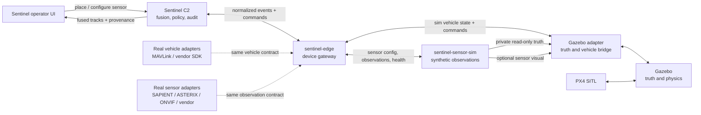

# Sentinel simulation, sensor, and platform MVP plan

Status: proposed
Date: 27 July 2026
Scope: hackathon MVP and demo, not an enterprise integration programme

## 1. Executive decision

Introduce two standalone services beside the existing Gazebo application:

1. `sentinel-edge`, the only operational ingress/egress boundary used by
   Sentinel C2 for sensors and vehicles.
2. `sentinel-sensor-sim`, a synthetic sensor producer that consumes Gazebo
   truth privately and publishes realistic sensor observations into
   `sentinel-edge`.

Extend the useful parts of `sentinel-sim/1.0`, but move them behind the edge
gateway instead of extending a direct UI-to-simulator dependency.

The MVP should prove three things:

1. An operator can place, configure, move, disable, and remove a sensor in
   Sentinel; the command crosses the edge gateway, creates the sensor in the
   standalone sensor simulator, and optionally creates its visual model in
   Gazebo.
2. The sensor simulator converts Gazebo truth into imperfect observations and
   publishes them through the same edge-gateway ingress contract that future
   real sensor adapters will use.
3. A small catalogue of drone archetypes behaves within evidence-backed public
   envelopes and can later be replaced by real vehicle adapters without changing
   the C2 domain model.

The key ownership rule is:

> Gazebo owns simulated world truth and physics. The standalone sensor
> simulator owns synthetic measurements and faults. The edge gateway owns
> device connectivity, normalization, validation, buffering, and command
> routing. Sentinel owns the operational track picture, policy, tasking, audit,
> and operator UI.

Do not call an airframe a "digital twin" unless it passes a documented
validation gate using held-out real flight evidence. The MVP should use the
terms `catalog profile`, `kinematic surrogate`, `physics surrogate`, and
`validated SITL profile`.

## 2. What the existing system already provides

The current codebase is a good base:

- `sentinel-sim/1.0` already separates Sentinel from the Gazebo/PX4 simulator
  over HTTP and WebSocket. Its client and lifecycle logic can be reused behind
  `sentinel-edge`.
- Gazebo publishes ENU pose and Sentinel converts it to WGS84.
- Vehicles have lifecycle, platform, backend, navigation-source, and fault
  fields.
- Commands are idempotent and reconnect performs a state refresh.
- The simulator platform registry already records evidence status, public
  sources, geometry, flight envelope, sensors, and explicit provisional values.
- `anafi_01` is a PX4 SITL reference; lightweight vehicles use Gazebo velocity
  control.
- The Sentinel sensor page is currently a static health catalogue. It does not
  yet represent simulator-owned, geospatial sensor instances.

This means the new feature is principally a protocol/domain extension plus a
UI workflow, not a rewrite.

## 3. Scope boundaries

### In the MVP

- Ground sensor placement on the Sentinel map.
- Radar, RF, EO/IR, and acoustic sensor archetypes.
- Sensor pose, orientation, range/FOV, update rate, health, and fault controls.
- Creation, update, and deletion routed through `sentinel-edge` and reflected
  in Sentinel, `sentinel-sensor-sim`, and Gazebo's optional visual model.
- Noisy, delayed, incomplete sensor observations generated by the standalone
  sensor simulator from a read-only Gazebo truth feed.
- Track fusion in Sentinel with source provenance and uncertainty.
- Replayable scenario files containing sensors, vehicles, cost bands, weather,
  and faults.
- Six drone archetypes covering the globally common operational classes.
- MAVLink/MAVSDK vehicle adapter contract and SAPIENT-inspired sensor-ingress
  contract, with simulated producers exercising both through `sentinel-edge`.
- A cost-exchange score for defensive scenario comparison.

### Explicitly out of scope

- A country-by-country inventory database.
- Exact replicas of proprietary military flight controls, signatures, sensors,
  weapons, or data links.
- Weapon effects, terminal homing, payload design, or autonomous lethal action.
- Hot-spawning many PX4 processes.
- Full ASTERIX, STANAG, Link 16, or every vendor SDK.
- Production-grade video analytics or SLAM.
- Claims that a synthetic observation proves real-world detection performance.
- Enterprise identity, cross-domain guards, accreditation, or classified data.

## 4. Research synthesis

### 4.1 What the reference HTML gets right

The "Domain research" section identifies three useful design facts:

- Communications are often the swarm bottleneck.
- A fibre-optic link resists RF jamming but does not create a mesh swarm.
- Resilience should be modeled as a graph that can reroute around lost nodes.

It also separates flight dynamics, formation, communications, and decision
layers. Preserve that separation. A vehicle being physically airborne must not
imply that its C2 link, navigation, payload, or cooperative graph is healthy.

The price tables in the HTML are useful scenario inspiration, but they are
open-source estimates. They must not become hard-coded procurement facts.

### 4.2 Global drone landscape: model families, not flags

An open-source March 2025 snapshot lists 48 states operating armed MALE drones.
The repeated families are more useful to the simulator than 48 national
variants:

| Global pattern | Representative public systems/operators | What Sentinel should model |
|---|---|---|
| Cheap FPV and commercial quadcopters | Generic 5–7 inch FPV; Mavic/ANAFI-class ISR; extensive use in Ukraine and by non-state actors | Short endurance, small signature, high agility, fragile link, very low replacement-cost band |
| Small tactical ISR | Orbiter 4, ScanEagle-class, Leleka/Furia-class | Runway-independent or compact launch, longer persistence than a quad, EO/IR cueing |
| One-way attack / decoy | Shahed/Geran-class and lower-cost decoys | Long, mostly preplanned route; GNSS degradation; RF-silent or low-emission cases; no weapon-effect model |
| Export MALE ISR/UCAV | Bayraktar TB2/Akinci, CH-3/CH-4/Wing Loong, Heron/Hermes, MQ-9/Protector | Persistent high-altitude sensor node, beyond-line-of-sight link, large operational/logistics footprint |
| Small interceptor | Generic inert FPV interceptor surrogate | High speed, short endurance, operator-in-loop, defensive cost band; collision/contact only |
| Collaborative combat aircraft | MQ-28A Ghost Bat-class experimental category | Multi-platform control and sensor collaboration; catalogue/kinematic only for MVP |

The most widespread export patterns are material to the demo:

- Baykar reported TB2/Akinci deliveries to 35 countries by early 2025.
- The March 2025 armed-MALE snapshot shows Chinese CH/Wing Loong families
  across Africa, the Middle East, and Asia; Turkish systems across Europe,
  Africa, the Middle East, and Asia; and US MQ-9 family systems in North America
  and Europe.
- Singapore publicly lists Hermes 900, Hermes 450, Heron 1, and Orbiter 4,
  which gives the demo locally relevant ISR reference envelopes.
- The US operates MQ-9 and the UK introduced Protector RG Mk1; both represent
  high-end persistent ISR rather than the low-cost end of the market.
- Australia is developing the MQ-28A collaborative combat aircraft. It belongs
  in future concept scenarios, not the first physics MVP.

This is a research taxonomy, not an assertion that every listed operator has the
same configuration, software, payload, readiness, or doctrine.

### 4.3 Cost asymmetry is a scenario outcome, not a drone price field

The reference HTML correctly highlights the gap between low-cost threats and
expensive defensive responses. Current reporting commonly estimates a
Shahed-class one-way attack drone in the tens of thousands of US dollars while
traditional missile interceptors can cost hundreds of thousands to millions.
Exact prices vary and are often not comparable because some figures include
support systems and others are marginal unit estimates.

Sentinel should therefore use broad, sourced cost bands:

- `disposable`: under USD 5k
- `low`: USD 5k–50k
- `medium`: USD 50k–500k
- `high`: USD 500k–5m
- `strategic`: above USD 5m
- `unknown`

For a completed defensive scenario calculate:

```text
defender marginal cost
  = expended effector cost
  + attrited interceptor cost
  + mission-variable sensor/flight cost

cost-exchange ratio
  = defender marginal cost / attacker marginal cost

cost-adjusted outcome
  = protected-value-preserved
  - defender marginal cost
  - expected damage from leakers
```

Always show both mission outcome and cost exchange. A cheap failed defence is
not a good result, and an expensive intercept may be justified against a
high-consequence target. The UI should explain, not automatically authorize,
the proposed response.

## 5. Target architecture



### 5.1 Three data planes

Keep these distinct in code and UI:

1. **Truth plane**: exact Gazebo entity state. Simulator/debug only.
2. **Observation plane**: what a sensor measured, including uncertainty,
   latency, false alarms, dropouts, and provenance.
3. **Track plane**: Sentinel's fused estimate and classification confidence.

The normal operator UI must never silently fall back from tracks to Gazebo
truth. A developer overlay may show truth with a permanent `SIM TRUTH` label.

### 5.2 Runtime boundaries

- Sentinel UI connects only to Sentinel C2.
- Sentinel C2 connects only to `sentinel-edge` for device data and commands.
- `sentinel-sensor-sim` is an edge producer, equivalent at the contract level
  to a real sensor adapter.
- Only simulation processes may access the Gazebo truth endpoint.
- Sensor-sim, edge gateway, Gazebo, and Sentinel must be independently
  startable, restartable, and deployable.

The detailed boundary, failure semantics, and deployment modes are specified in
`EDGE_GATEWAY_SENSOR_SIM_ARCHITECTURE.md`.

### 5.3 One canonical coordinate/time contract

- World positions: WGS84 in Sentinel, local ENU in Gazebo.
- Sensor-relative measurements: sensor frame with explicit transform.
- Every message: `observedAt`, `receivedAt`, monotonic sequence, source clock
  quality, and coordinate frame.
- All covariance values use SI units and documented ordering.
- Reject observations with unknown frame, impossible timestamp, or stale
  configuration revision.

## 6. Edge protocol 1.1 proposal

Move the existing simulator client behavior behind `sentinel-edge`. Protocol
1.1 should be additive: a 1.0-compatible vehicle adapter can continue to manage
vehicles, while a 1.1 edge handshake advertises new capabilities:

```json
{
  "capabilities": [
    "vehicle.spawn",
    "vehicle.command",
    "source.registration",
    "source.health",
    "sensor.catalog",
    "sensor.runtime-crud",
    "sensor.observations",
    "scenario.cost-bands"
  ]
}
```

### 6.1 Sensor type

```ts
type SensorType = {
  sensorTypeId: string
  displayName: string
  modality: 'radar' | 'rf' | 'eo' | 'ir' | 'acoustic'
  measurementKinds: Array<
    'range' | 'bearing' | 'elevation' | 'radial_velocity' |
    'classification' | 'emitter' | 'image_reference'
  >
  defaults: {
    maxRangeM: number
    horizontalFovDeg: number
    verticalFovDeg: number
    updateRateHz: number
  }
  evidenceStatus: 'authoritative' | 'public_partial' | 'notional'
  sources: string[]
}
```

### 6.2 Runtime sensor instance

```ts
type SimSensor = {
  sensorId: string
  sensorTypeId: string
  displayName: string
  lifecycle: 'REQUESTED' | 'SPAWNING' | 'ACTIVE' | 'DEGRADED' |
    'FAULT' | 'REMOVED'
  pose: {
    frame: 'LOCAL_ENU'
    eastM: number
    northM: number
    upM: number
    rollRad: number
    pitchRad: number
    yawRad: number
  }
  configuration: {
    maxRangeM: number
    horizontalFovDeg: number
    verticalFovDeg: number
    updateRateHz: number
  }
  configurationRevision: number
  source: 'scenario' | 'runtime'
  updatedAt: string
}
```

### 6.3 Normalized observation

```ts
type SensorObservation = {
  observationId: string
  sensorId: string
  modality: 'radar' | 'rf' | 'eo' | 'ir' | 'acoustic'
  sequence: number
  observedAt: string
  receivedAt: string
  frame: 'WGS84' | 'LOCAL_ENU' | 'SENSOR'
  measurement: {
    rangeM?: number
    bearingRad?: number
    elevationRad?: number
    radialVelocityMS?: number
    position?: { latDeg: number; lngDeg: number; altitudeM: number }
    emitterFamily?: string
    classification?: Array<{ label: string; confidence: number }>
    mediaRef?: string
  }
  covariance?: number[]
  quality: {
    confidence: number
    signalToNoiseDb?: number
    latencyMs: number
    clockQuality: 'synced' | 'estimated' | 'unknown'
  }
  simulation?: {
    modelRevision: string
  }
}
```

`truthEntityId` is allowed only in a separate private sensor-sim debug record.
It must not be present in the observation sent to `sentinel-edge`; production
gateway builds must reject it.

### 6.4 Endpoints and events

Edge gateway C2 API:

- `GET /v1/sensor-types`
- `GET /v1/sensors`
- `POST /v1/sensors`
- `PATCH /v1/sensors/:sensorId`
- `DELETE /v1/sensors/:sensorId`
- `POST /v1/sensors/:sensorId/faults`
- `GET /v1/sources`
- `GET /v1/health`

WebSocket events:

- `source.lifecycle`
- `sensor.lifecycle`
- `sensor.configuration`
- `sensor.observation`
- `sensor.health`

Producer ingress:

- Register source identity and declared capabilities.
- Publish observation, vehicle-state, and health batches.
- Receive allow-listed commands and acknowledge their completion.
- Use Protobuf as the schema source of truth and gRPC streaming for the MVP
  adapter/simulator transport.

Sentinel C2 proxy:

- Mirror the routes under `/api/v1/edge/...`.
- Require the existing pairing token for operator mutations.
- Add idempotency keys to create, update, delete, and command operations.
- Reconcile source, sensor, and vehicle snapshots after reconnect.

Do not stream camera pixels in the event envelope. Stream metadata and a
short-lived `mediaRef`; use a separate bounded video/image transport.

## 7. Sensor simulation plan

### 7.1 MVP modalities

| Modality | Simulated output | Important limitation to show |
|---|---|---|
| Radar | range, bearing, elevation, radial velocity, confidence | clutter, occlusion, small-target probability, active emission |
| RF | bearing, emitter family, confidence | no detection for RF-silent, autonomous, or fibre-controlled target |
| EO/IR | bearing/elevation, class probabilities, optional thumbnail reference | weather, light/thermal contrast, line of sight, compute latency |
| Acoustic | bearing and class probability | short range, urban/background noise, weak absolute range |

LiDAR remains an onboard obstacle/geometry sensor in the MVP. It should not be
presented as the primary wide-area counter-UAS sensor.

### 7.2 Modeling method

For every sensor tick, `sentinel-sensor-sim`:

1. Reads candidate Gazebo entities from the private truth feed.
2. Apply line-of-sight and terrain/building occlusion.
3. Compute modality-specific detection probability.
4. Apply seeded noise, bias, latency, packet loss, and false alarms.
5. Publishes a raw observation with covariance and quality to `sentinel-edge`.
6. Never publishes a fused identity, Gazebo entity ID, or perfect target pose.

Seed all randomness from `scenarioSeed + sensorId` so a demo is repeatable.

### 7.3 Placement workflow

1. Operator selects **Add sensor**.
2. Operator chooses an archetype and clicks a map position.
3. A ghost coverage sector shows range and orientation.
4. Operator rotates the sector and confirms.
5. Sentinel submits local ENU pose to `sentinel-edge`.
6. The edge gateway routes the configuration to `sentinel-sensor-sim`.
7. Sensor-sim activates its observation producer and asks the Gazebo adapter
   for an optional visible, non-physical or fixed-base model.
8. `sensor.lifecycle: ACTIVE` replaces the ghost with the live entity.
9. UI shows health, observation rate, coverage, and current contributors.

If creation fails, remove the ghost and show the gateway error. For batch
placement, use the existing all-or-rollback fleet pattern.

### 7.4 Sensor faults for the demo

- offline
- packet loss
- added latency
- bearing bias
- reduced detection range
- RF target goes silent
- EO obscured by rain/fog/night
- acoustic background-noise increase

These are sensor faults, not changes to Gazebo truth.

## 8. Drone fidelity and real counterpart plan

### 8.1 Fidelity levels

| Level | Name | Required evidence | Allowed claim |
|---|---|---|---|
| L0 | Catalog | public identity/category only | UI/scenario selection |
| L1 | Kinematic surrogate | public dimensions and broad envelope, or explicitly notional values | representative motion and scale |
| L2 | Physics surrogate | documented mass/geometry plus plausible dynamics and tests | simulator integration profile |
| L3 | Validated SITL | held-out flight log replay plus collision and estimator gates | matches tested observable envelope |
| L4 | Hardware-linked | real autopilot/payload on bench or controlled range | adapter compatibility for tested hardware/version |

No level implies proprietary firmware equivalence.

### 8.2 MVP platform catalogue

Keep the four existing profiles and add only the archetypes needed for the
story:

| Priority | Profile | Target fidelity | Purpose |
|---|---|---|---|
| P0 | Parrot ANAFI baseline | L3 for observable flight envelope when validation passes | real/sim bridge reference |
| P0 | Generic inert FPV interceptor | L1/L2 | low-cost defensive interceptor and contact demonstration |
| P0 | DefendTex D40/D155 profiles | existing evidence status | small and heavy-lift Australian-linked profiles |
| P1 | Commercial ISR quad archetype | L1 | globally common low-cost reconnaissance target/friendly asset |
| P1 | Orbiter 4 / tactical fixed-wing archetype | L1 | locally relevant persistent close-range ISR |
| P1 | Shahed-class inert OWA surrogate | L1 | long-route, RF-silent/decoy cost-asymmetry scenario |
| P2 | MALE ISR archetype | L0/L1, kinematic only | Heron/Hermes/TB2/CH/MQ-9 family scenario role |
| P3 | Collaborative aircraft archetype | L0 only | future concept, not MVP physics |

The current 5 km world is too small to demonstrate genuine MALE endurance,
range, or satellite-link operations. MALE profiles should be shown as
catalogue/kinematic context or in time/space-compressed scenarios, clearly
labeled as scaled.

### 8.3 Real vehicle adapter interface

Normalize a real or simulated vehicle into:

- identity and platform profile revision
- lifecycle and arming state
- position, attitude, velocity, and covariance
- battery/energy and link state
- navigation source and estimator health
- payload component inventory
- command capability discovery
- command acknowledgement and timeout

Adapter priorities:

1. **MAVLink/MAVSDK**: PX4 and ArduPilot-class telemetry/control.
2. **PX4 ROS 2/uXRCE-DDS**: high-rate estimator and payload topics where needed.
3. **Vendor adapter**: thin process implementing the same interface; never put
   vendor SDK calls in the C2 domain layer.
4. **Replay adapter**: deterministic logs for demos and regression tests.

Use MAVLink system/component IDs and component metadata to discover autopilot,
camera, and gimbal components. Configuration must be allow-listed per
platform/firmware revision; discovery is not blanket permission to command.

### 8.4 Real/sim validation gates

For each L3 candidate:

- Record real log schema, firmware, environment, payload, and calibration.
- Split calibration and validation flights by complete flight, not samples.
- Compare speed, acceleration, turn/yaw response, climb/descent, energy,
  estimator uncertainty, command latency, and failsafe transitions.
- Define tolerances before viewing held-out results.
- Require a separate collision/contact test.
- Publish a machine-readable report and retain failed results.
- Downgrade the profile automatically if its evidence or firmware revision no
  longer matches.

## 9. Edge adapter strategy for sensors

All adapters connect to `sentinel-edge` and emit the same `SensorObservation`
contract plus a separate health stream. Sentinel C2 has no vendor or simulator
adapter code.

| Adapter | MVP use | Notes |
|---|---|---|
| Standalone sensor-sim producer | primary simulated sensors | consumes private Gazebo truth; publishes canonical observations over the edge producer API |
| Gazebo truth client | sensor-sim input only | never registered as an operational sensor source |
| ROS 2 bridge | optional demo/bench path | use standard message types where they fit; preserve original timestamp/frame |
| NDJSON replay | test and demo fallback | exact timing or accelerated playback |
| SAPIENT/Protobuf adapter | preferred public sensor interface | preserve detection geometry, classification, association, tasking, and health semantics |
| ASTERIX adapter | radar integration | start with CAT-048 tracks; retain source time and track status |
| UDP/JSON vendor shim | generic hardware stub | isolate vendor schema; bounded packet size and source allow-list |
| RTSP/ONVIF media | deferred or thumbnail-only | keep pixels off the event bus |
| CoT/STANAG | post-MVP | add only for a named partner system and conformance test |

Every adapter must implement:

- explicit source identity and configuration revision
- bounded queue and backpressure policy
- timestamp/frame validation
- heartbeat and delivery metrics
- reconnect with snapshot/re-subscribe
- raw-message capture with retention limits
- circuit breaker after repeated malformed data
- simulation/live/replay source label in every UI view and audit record

## 10. Track fusion changes

The current demo provenance assigns sensor types to already-formed tracks. Flip
that dependency:

```text
observations -> association -> state estimate -> classification -> threat policy
```

MVP fusion can be deliberately modest:

- nearest-neighbour gating in position/velocity space
- constant-velocity Kalman filter
- track confirmation after configurable multi-hit criteria
- coast and drop thresholds
- class confidence combined conservatively
- provenance list of actual contributing observation IDs

Acceptance requires that a single bearing-only observation does not create a
perfect 3D position. Two suitable bearings, or a bearing plus range source,
should reduce uncertainty visibly.

## 11. UI work

### Map

- **Add sensor** tool with catalogue, placement ghost, orientation, and confirm.
- Coverage cones/rings colored by modality and health.
- Separate toggles for sensors, raw observations, fused tracks, and sim truth
  debug.
- Select sensor to see configuration, health, observation rate, and faults.
- Drag/move is an explicit edit-confirm action, not continuous silent mutation.

### Sensor workspace

Replace static `SENSOR_SOURCES` rows with live instances plus service-level
adapters such as CDSE:

- sensor type and instance ID
- simulator/live/replay badge
- health and freshness
- observed/received latency
- observation and drop rate
- current configuration revision
- latest fault/error
- contributing track count

### Track detail

- Fused estimate and covariance.
- Timeline of contributing modalities.
- "Why this classification?" evidence.
- Explicit stale/coasting state.
- Never show a Gazebo truth ID as operator evidence.

### Cost-asymmetry panel

For a scenario, show:

- threat count and cost bands
- proposed defensive response and cost band
- expected probability of success as a range
- cost-exchange range
- protected-value consequence
- lower-cost alternatives that satisfy policy
- operator confirmation/veto and audit reason

## 12. Delivery plan

Assumption: three engineers (sim/backend, UI, integration/test), with access to
the existing simulator. Elapsed estimates include parallel work and are not
procurement or hardware lead times.

### Phase 0 — contract and evidence baseline (week 1)

Deliver:

- ADR for truth/observation/track ownership.
- Edge producer and C2 API Protobuf schemas, generated JSON representations,
  and compatibility rules.
- Sensor/platform fidelity vocabulary.
- Scenario seed and cost-band schema.
- Golden contract fixtures shared by all four runtime applications.

Exit:

- The existing 1.0 simulator adapter works behind a 1.1 edge gateway.
- Invalid frames, timestamps, and revisions fail schema tests.

### Phase 1 — standalone edge gateway (weeks 1–3)

Deliver:

- Extract `sentinel-edge` as an independently runnable service.
- Source registration, identity, health, buffering, and reconnect behavior.
- Vehicle telemetry/command adapter for the existing Gazebo gateway.
- C2 HTTP/WebSocket API and producer gRPC API.
- Contract fixtures proving source-mode and truth-field rejection.

Exit:

- Sentinel uses the edge gateway for existing simulated vehicle telemetry and
  commands without a UI domain-model change.
- Edge restart reconciles sources and vehicles without duplicates.
- A production gateway build rejects the Gazebo truth schema.

### Phase 2 — standalone sensor-sim and placement (weeks 2–4)

Deliver:

- Extract `sentinel-sensor-sim` as an independently runnable service.
- Private read-only Gazebo truth client.
- Sensor type registry and runtime lifecycle in sensor-sim.
- Sensor CRUD routes/events through `sentinel-edge`.
- Sentinel proxy and Redux/domain state.
- Map placement, rotate, confirm, move, delete.
- Save/load sensors in scenarios.

Exit:

- A radar placed on the phone appears at the corresponding Gazebo ENU pose in
  under two seconds.
- Restart/reconnect of sensor-sim reconciles the same sensor once, with no
  duplicate.
- Failed batch placement rolls back.

### Phase 3 — observation stream and fusion (weeks 4–6)

Deliver:

- Radar and RF first, EO/IR and acoustic second.
- Sensor-sim noise, latency, occlusion, packet loss, false alarms, and seeded
  replay.
- Observation normalizer and modest multi-sensor fusion.
- Track provenance and uncertainty UI.

Exit:

- RF-silent target is not detected by RF.
- Occluded target is not perfectly observed by EO.
- Two sensors visibly improve a fused estimate.
- Truth never reaches the normal operator track path.

### Phase 4 — platform fidelity profiles (weeks 5–7)

Deliver:

- Fidelity level in platform registry/API/UI.
- Commercial quad, tactical fixed-wing, OWA, and MALE archetypes.
- Public source/evidence register updates.
- ANAFI held-out replay report or an explicit L2 status if evidence is
  insufficient.

Exit:

- Every numeric profile field is sourced or marked provisional.
- Each platform carries a machine-readable claim level.
- Scaled MALE behavior is visibly labeled.

### Phase 5 — real/replay adapters (weeks 7–9)

Deliver:

- MAVLink/MAVSDK vehicle adapter using the same normalized vehicle state.
- One bench sensor adapter using SAPIENT, ROS 2, or the available vendor API.
- NDJSON observation replay adapter.
- Adapter health, backpressure, reconnect, and source badges.

Exit:

- Switch `sim -> replay -> live bench` without changing C2 track/fleet types.
- Link loss produces stale/degraded state rather than frozen "healthy" data.
- Commands are allow-listed and acknowledged end-to-end.

### Phase 6 — cost-asymmetry demo and hardening (weeks 9–11)

Deliver:

- Repeatable mixed-threat scenario with decoys and RF-silent target.
- Cost bands and cost-exchange explanation.
- Sensor/vehicle fault choreography.
- Automated contract, reconnect, performance, and visual acceptance.
- Demo fallback: recorded replay and preflight readiness check.

Exit:

- 20-minute scripted demo can be repeated three times with the same seed.
- Operator can detect, inspect evidence, choose a proportionate defensive
  response, confirm/veto, hold/recall, and review the audit.
- Gateway interruption recovers without duplicate sensors, tracks, or commands.

Expected total: about 9–11 elapsed weeks for a focused three-person squad, or
roughly 22–28 engineer-weeks. A hackathon cut can stop after Phase 3 plus two
platform archetypes and use replay instead of live hardware.

## 13. Prioritized backlog

### Must have for demo

- `SEN-EDGE-101` Standalone edge gateway process and deployment configuration.
- `SEN-EDGE-102` Producer registration, health, buffering, and reconnect.
- `SEN-EDGE-103` Protobuf contracts and compatibility/conformance fixtures.
- `SEN-EDGE-104` Existing Gazebo vehicle adapter behind the edge boundary.
- `SEN-SIM-101` Standalone sensor-sim process and private truth client.
- `SEN-SIM-102` Sensor registry and optional Gazebo visual-model lifecycle.
- `SEN-UI-101` Map placement/rotation/confirmation workflow.
- `SEN-SIM-103` Radar observation model.
- `SEN-SIM-104` RF observation model including silent-link case.
- `SEN-C2-101` Observation ingestion and track association.
- `SEN-C2-102` Fused covariance and provenance.
- `SEN-UI-102` Live sensor health and source badges.
- `PLAT-101` Fidelity/evidence level in platform API and UI.
- `PLAT-102` OWA and tactical ISR kinematic archetypes.
- `DEMO-101` Seeded cost-asymmetry scenario and replay fallback.

### Should have

- EO/IR and acoustic models.
- ROS 2 adapter.
- ANAFI held-out flight-envelope validation.
- Sensor batch placement and templates.
- Cost-exchange explanation panel.
- Weather/visibility presets.

### Later

- Video transport and analytics.
- HIL autopilot bench.
- Named vendor adapters.
- ASTERIX/CoT/STANAG interoperability.
- NS-3/OMNeT++ network co-simulation.
- Large-world MALE scenarios.
- Collaborative aircraft behavior.
- Enterprise security/accreditation.

## 14. Test and acceptance matrix

| Area | Test | Pass condition |
|---|---|---|
| Coordinates | UI map click to Gazebo model | horizontal error under 1 m at world origin test points |
| Lifecycle | create/update/delete/reconnect | exactly-once final state after retries |
| Timing | observation timestamp path | latency reported; out-of-order data bounded and counted |
| Fusion | bearing-only source | no false precise 3D position |
| Fusion | radar + EO/RF | uncertainty decreases and provenance includes both |
| Sensor realism | RF-silent target | no RF observation |
| Sensor realism | EO behind building | no direct EO observation without configured false alarm |
| Faults | packet loss/latency/offline | health and track freshness degrade correctly |
| Separation | normal operator path | no Gazebo truth identity or perfect pose |
| Platform claims | registry validation | every provisional field and source status is explicit |
| Adapter | disconnect/reconnect | stale state, no silent frozen health, clean recovery |
| Load | 32 vehicles, 12 sensors | target UI frame rate and event lag agreed before test |
| Security | mutation route | pairing token and idempotency key required |
| Demo | fixed seed | three repeatable runs with stored audit |

Set concrete event-rate and UI performance targets after measuring the current
laptop. Do not promise raw 30 Hz imagery for every sensor through the JSON event
bus.

## 15. Demo story

1. Load a Singapore scenario with a protected site, mixed buildings, two
   existing sensors, and a small friendly fleet.
2. Place an RF sensor and radar from the Sentinel phone UI; show both appear in
   Gazebo.
3. Launch a commercial-quad track and an RF-silent OWA surrogate plus cheap
   decoys.
4. RF detects only the emitting target; radar supplies range/radial velocity;
   EO/IR is initially occluded.
5. Place or rotate an EO/IR sensor to improve classification and watch fused
   uncertainty shrink.
6. Deny GNSS on `anafi_01`; show estimator-source handover without claiming
   real VIO validation.
7. Sentinel proposes defensive assignments and shows cost-exchange ranges. The
   operator confirms one and vetoes an unnecessarily expensive alternative.
8. Inject sensor packet loss and a vehicle link fault; show degraded health,
   graph rerouting, hold/recall, and audit.
9. End on the evidence panel: what was real, simulated, provisional, and
   validated.

## 16. Risks and mitigations

| Risk | Impact | Mitigation |
|---|---|---|
| Sensor UI accidentally displays truth | demo overclaims capability | hard separation, source badges, truth-only debug build flag |
| Too many named airframes | schedule and evidence collapse | six archetypes; named products are evidence references, not replicas |
| Camera data overwhelms WebSocket | lag and crashes | metadata/media split, bounded queues, thumbnails |
| MALE aircraft in 5 km world looks absurd | credibility loss | catalogue/kinematic only, scaled label, defer large world |
| Vendor integration blocks demo | no live path | NDJSON replay is a first-class adapter |
| Price estimates treated as facts | misleading recommendations | cost bands, source date, ranges, scenario assumptions |
| Random simulation changes each run | unreliable demo | deterministic seeds and recorded fallback |
| Real link drops freeze last value | unsafe operator picture | freshness TTL, stale/degraded state, circuit breaker |
| Dirty schemas diverge between repos | integration regressions | shared golden fixtures and consumer-driven contract tests |

## 17. Decisions required before implementation

These are the only choices that materially change the plan:

1. Which one real autopilot/vehicle is available for the bench demo?
2. Which one real or emulated external sensor feed is available?
3. Is the demo story defensive counter-UAS only, or must it also show friendly
   reconnaissance?
4. What laptop GPU/CPU is the performance baseline?
5. Are cost bands visible to operators, judges only, or both?
6. May the demo use named airframes in the UI, or should all military profiles
   remain generic archetypes?

If these answers are unavailable, proceed with PX4/ANAFI, ROS 2 radar, both
defensive and reconnaissance views, the current laptop, cost bands visible in
the evidence panel, and generic archetype names.

## 18. Research sources

- Sentinel reference HTML supplied by the team:
  `C:\Users\nsf.yusuf\Downloads\sentinel-reference.html`
- Existing integration contract:
  `docs/SIMULATOR_INTEGRATION.md`
- Gazebo Sensors documentation:
  <https://gazebosim.org/libs/sensors/>
- PX4 simulation interfaces:
  <https://docs.px4.io/main/en/simulation/>
- MAVLink component metadata and discovery:
  <https://mavlink.io/en/services/component_metadata.html>
- MAVLink system/component identity:
  <https://mavlink.io/en/services/mavlink_id_assignment.html>
- March 2025 snapshot of states operating armed MALE drones:
  <https://dronewars.net/wp-content/uploads/2025/03/States-with-table-March-2025.pdf>
- Baykar 2024 export statement:
  <https://baykartech.com/en/press/baykar-the-global-leader-in-ucav-exports-achieves-18-billion-in-exports-in-2024/>
- Republic of Singapore Air Force UAV inventory/specifications:
  <https://www.rsaf.gov.sg/rsaf-forces/aircraft/>
- US Air Force MQ-9 fact sheet:
  <https://www.af.mil/About-Us/Fact-Sheets/Display/Article/104470/mq-9-reaper/>
- Royal Air Force Protector entry into service:
  <https://www.raf.mod.uk/news/articles/protector-enters-service-with-royal-air-force/>
- Australian MQ-28A development milestone:
  <https://www.minister.defence.gov.au/media-releases/2025-06-16/key-milestone-development-australian-made-combat-drone>
- NATO counter-drone interoperability exercise and evaluation criteria:
  <https://www.ncia.nato.int/newsroom/news/allies-and-industry-test-the-latest-counterdrone-technology-during-nato-exercise>
- NATO fibre-optic drone challenge:
  <https://www.act.nato.int/article/innovation-challenge-fibre-optic-drones/>
- CSIS analysis of Shahed saturation and cost exchange:
  <https://www.csis.org/analysis/drone-saturation-russias-shahed-campaign>

All platform and cost claims must retain source date and evidence status. This
document is a planning baseline, not a procurement recommendation.
