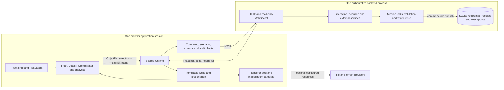

# Sentinel v3 architecture and codebase blueprint

This is the canonical description of the current implementation and its review boundaries. Start with the [root README](../README.md) for installation and the [runbook](demo-runbook.md) for operation. Frozen specifications describe requirements; historical phase reports describe their own delivery dates. Neither automatically certifies current behavior.

The current assessment baseline is the **working tree**, HEAD `f98de4f` plus uncommitted changes, identified by the 680-file digest `0207f2e9…154e5`. It includes application diagnostics and review tools added after Claude's preserved candidate 6. [Assessment results](assessment/TEST-RESULTS.md) identify the exact source, commands and evidence. The original 21 September documentation audit covered the earlier 788-file cleaned baseline at HEAD `30414540…`; its [ledger](maintenance/documentation-2026-09-21.md) remains historical evidence.

## 1. Purpose, implemented scope and deployment boundary

Sentinel presents mission entities, observations, explicit resources and recorded activity in one dockable workspace. Its backend owns authoritative simulation state and durable recordings; the browser owns inspection, command requests and presentation.

| Operating mode | Implemented responsibility | Boundary |
| --- | --- | --- |
| Interactive synthetic mission | Author saved scenarios; explicitly control eligible actors; run movement, schedules, local Fleet behavior and notional outcomes; Pause/Resume/End | One nonterminal interactive run per database. Not real aircraft dispatch or a physically validated effects model. |
| Recorded inspection | Load an ended mission's committed final world; inspect events, receipts, outcomes and bounded observed history | Does not replay the executor or dispatch a command. Timeline seeking/playback is deferred. |
| External simulation | Validate supplied v1 JSON batches; acknowledge lifecycle; resolve and record results; map an isolated external mission into the shared workspace | Compatibility interpretations remain provisional. No interactive/external bridge or continuous live feed. |
| Developer fixtures | Opt-in deterministic synthetic worlds and explicit fixture advancement | Labelled test/demo data, not sensor reports or operational evidence. |

Views include Tactical (MapLibre), ordinary 3D (Cesium), a separately labelled simulated Video viewpoint, Fleet/Details, Orchestrator, Suggestions and Command Picture/Profile. Suggestions use existing deterministic rules and require explicit Apply; there is no live LLM command service. Timeline, operational pop-outs, real video ingest, terrain-clearance analysis, sensor confidence/coverage and predictive risk are not implemented capabilities. Session replay types and a workspace pop-out harness are foundations, not accepted operational features.

The supported local launch binds Vite and Uvicorn to **127.0.0.1**. Development serves the browser on 5180 and proxies `/api` HTTP/WebSocket to 8000. Preview uses 5181; verification preview uses 5182. [Vite configuration](../frontend/vite.config.ts) owns these proxies/assets; [FastAPI startup](../backend/app/main.py) constructs services and recovery. There is no production ingress, TLS termination, user authentication service or multi-worker coordination supplied here. One backend process/worker owns a database. Remote deployment needs a separately reviewed access, transport and resource-control design.

## 2. Repository and component map

| Location / entry point | Responsibility and principal dependencies |
| --- | --- |
| [frontend/package.json](../frontend/package.json), [src/main.tsx](../frontend/src/main.tsx) | React 19.3 entry, one runtime and workspace bridge; Vite 8.3, TypeScript 6.0.3. Verification-only hooks are conditional on build mode. |
| [app/runtime.ts](../frontend/src/app/runtime.ts), [OperationalContext.tsx](../frontend/src/app/OperationalContext.tsx) | Session transport, coherent world presentation, command/scenario/external clients, selection, motion, history and analytic owners. |
| [workspaceBridge.ts](../frontend/src/features/workspace/workspaceBridge.ts), [WorkspaceHost.tsx](../frontend/src/features/workspace/WorkspaceHost.tsx), [PaneHost.tsx](../frontend/src/features/workspace/PaneHost.tsx) | FlexLayout 0.10.8 docking, pane identity, visibility, resize, focus and lifecycle. |
| [moduleRegistry.ts](../frontend/src/app/moduleRegistry.ts), [viewRegistry.ts](../frontend/src/features/workspace/viewRegistry.ts) | Navigation capabilities and view kinds; actual rendering branches live in PaneHost. Some registry fallback strings are placeholders, not proof a routed view is absent. |
| [state/](../frontend/src/state), [world/](../frontend/src/world) | Zustand 5 stores, immutable world reduction, selectors, movement/review presentation, geometry, observed histories and motion sampling. |
| [services/](../frontend/src/services) | Validated API boundaries and identity-preserving interactive/scenario/audit/recommendation clients. |
| [features/entities/](../frontend/src/features/entities), [features/orchestrator/](../frontend/src/features/orchestrator) | Fleet/Tracks/Details, shared selection and unified Units/Conductor authoring. |
| [features/analytics/](../frontend/src/features/analytics) | One ECharts 6.0 implementation: current projections, recorded activity/statistics, comparisons and reusable Vertical Profile. |
| [renderers/](../frontend/src/renderers) | MapLibre 6.9, Cesium 1.145, PMTiles 4.5 adapters; resource pool, camera bookmarks, provider/altitude policy. |
| [modules/simulation/](../frontend/src/modules/simulation) | Typed external contract/client/result UI and Details projection. Raw external objects stay outside generic world schemas. |
| [backend/app/main.py](../backend/app/main.py), [api/](../backend/app/api) | FastAPI 0.141.1, Pydantic 2.13.5, Uvicorn 0.52.4; HTTP/WS validation, service lifetime and errors. |
| [missions/service.py](../backend/app/missions/service.py), [domain/](../backend/app/domain), [world/serialization.py](../backend/app/world/serialization.py) | Mission locks, source-writer fencing, validated complete frames/deltas, strict historical readers and canonical serialization. |
| [commands/](../backend/app/commands), [scenarios/](../backend/app/scenarios) | Control leases/grants/intents, exact receipts, movement/schedules/Fleet outcomes; saved revisions, frozen location, admission and nominal analysis. |
| [recording/](../backend/app/recording) | SQLite authority, atomic journal/checkpoints, lossless codec, history projections and read-only operational audit. |
| [simulation/](../backend/app/simulation), [adapters/simulation_v1/](../backend/app/adapters/simulation_v1) | External validation/resolution/calibration/journal and its owned generic-world projection. |
| [contracts/sentinel/](../contracts/sentinel), [contracts/simulation/](../contracts/simulation) | Versioned JSON schemas/OpenAPI/fixtures and frozen external package; current Sentinel export package is v1.16. |
| [scripts/](../scripts), [backend/drafts/](../backend/drafts) | Schema/export/hash/hygiene checks, bounded diagnostic programs and still-used foundation inputs. |
| [backend/tests/](../backend/tests), [frontend/tests/](../frontend/tests) | Backend transactional/semantic tests; Vitest unit, Playwright browser and separate foreground/performance harnesses. |
| [docs/README.md](README.md), [ARCHIVE.md](ARCHIVE.md) | Canonical contract/workflow links, historical reports and SHA-256 archive/readback convention. |
| `backend/data/`, `frontend/.env.local`, `frontend/.cache/` | Local recordings, configuration and task databases; ignored data is not disposable by default. |
| [research-brain/](../research-brain) | Separately maintained research, outside runtime and this documentation task's edit scope. |

Dependency versions above are lock/manifest facts, not claims that every later release is compatible. Python requirements pin direct packages but do not fully lock transitive resolution; the frontend has an npm lockfile. Other UI dependencies include Radix, TanStack Table, Lucide, Tailwind and AJV. There is one chart library; there is no second analytic event store.

## 3. Runtime ownership



### Frontend owners

- [worldStore](../frontend/src/state/worldStore.ts) holds the immutable live replica and connection status. [reduce](../frontend/src/world/reduce.ts) applies validated deltas to a complete frame. It is not a source writer.
- [sessionStore](../frontend/src/state/sessionStore.ts) owns mission-scoped `ObjectRef` selection, filters, time mode and transient operator intent. [presentation](../frontend/src/world/presentation.ts) selects one whole frame; it never mixes dictionaries from live and historical moments.
- [runtime](../frontend/src/app/runtime.ts) owns one mission WebSocket, catalog refresh/reconnect, motion, command reconciliation and observed-history demand. Mission/socket/request generations and abort controllers reject late responses. Mission switching clears old frame/history/selection state and invalidates work; opening another pane does not open another mission transport.
- [workspace metadata](../frontend/src/state/workspaceStore.ts) is derived solely by WorkspaceBridge: pane placement, active tab, sidebar and Orchestrator tab. No world, command authority or GPU object belongs in the layout. Automatic browser persistence of the entire layout is not implemented.
- [OperationalContext](../frontend/src/app/OperationalContext.tsx) suspends hidden panes' runtime subscriptions while preserving local form state. Reopening reads a fresh snapshot. The shared runtime continues authoritative transport/reconciliation; hiding a pane does not pause the simulation.
- [selectionActions](../frontend/src/features/entities/selectionActions.ts) routes chart/list/map selection to existing Details behavior. [entityRows](../frontend/src/world/entityRows.ts) chooses one displayed Track per Entity: source filtering precedes deterministic non-ended/latest-timestamp/ID arbitration. This is display arbitration, not sensor fusion. Pinned inspectors retain their own explicit mission/entity identity.
- [Orchestrator](../frontend/src/features/orchestrator/OrchestratorPane.tsx) wraps Units and Conductor around one scenario client. Hidden internal tabs suspend work and disarm map-picking. [orchestratorLayout](../frontend/src/features/workspace/orchestratorLayout.ts) normalizes legacy Units/Conductor aliases without creating a second editor or mutating neighboring panes.

### Backend owners

[MissionService](../backend/app/missions/service.py) serializes commits with an asyncio lock per mission. The repository has a synchronous connection/transaction lock. An explicit `mission_writers` claim rejects a different source; external missions cannot be mutated by the interactive executor. Local command services additionally enforce their own run/control bindings.

[InteractiveService](../backend/app/commands/service.py) owns run admission, control, scheduled/live execution and recovery. [ScenarioService](../backend/app/scenarios/service.py) owns saved definitions/revisions and complete review; its private analysis never owns a live world. [SimulationService](../backend/app/simulation/service.py) owns external lifecycle and serializes submissions through its gate plus the mission lock.

The source loop advances a fixed **0.2 seconds of source time per running tick** and sleeps for the remaining wall-time cadence, with no catch-up bursts. Slow work can cause source-clock drift. SQLite failure prevents publication and leaves the last committed view available; it is not converted into a fabricated observation. Shutdown cancels/awaits source and external work, closes analysis and then closes the repository.

### Application diagnostics

Each FastAPI application instance owns [Telemetry](../backend/app/observability.py): readable console events, optional rotating JSONL, bounded counters and elapsed-time summaries. HTTP replies expose a server-generated `X-Sentinel-Trace`; external processing retains it in the shielded task. Preparation, completed recording, rejected requests and exact retries have distinct events. Publication hooks run after the enclosing transaction commits. Diagnostic sink failures do not change authoritative success.

`GET /api/diagnostics/metrics` describes the current process and resets on restart; it is outside the frozen mission contract. Diagnostic durations use `time.perf_counter()`, while existing source scheduling is unchanged. Logs and metrics are separate from durable receipts/recordings and share the process's blocking limitations. See [implementation notes](assessment/IMPLEMENTATION-NOTES.md), [logging tests](../backend/tests/test_observability.py) and [live demonstration](assessment/DEMO-RUNBOOK.md).

## 4. Domain, contracts, identities and time

| Concept | Meaning / implementation |
| --- | --- |
| Mission / Recording | Mission is the domain context; the recording is established durably before its first frame. Recording ID and stream epoch fence history/transport identity. |
| Entity / Track | Entity is persistent identity/classification/presence/condition. Track is a source observation series with timestamped position/velocity; an Entity may have multiple or no Tracks. |
| Asset / control / assignment | Asset explicitly declares a managed resource and availability. Control bindings/grants and Fleet assignments are separate. Friendly or external BLUE affiliation confers none of these by itself. |
| Sensor / Zone / Task / Event | Generic world collections have explicit IDs and mission references. Zones retain geometry/validity. Events carry authoritative identities and their own sequence, distinct from frame sequence. |
| WorldFrame | Whole committed state keyed by mission, recording, stream epoch, frame ID and sequence. `recentEvents` is only a 100-event tail; the journal is retained separately. |
| Scenario reference | Exact definition ID/revision/hash identifies saved content. A running mission records a frozen revision and location; editing a draft cannot change that run. |
| Command / execution | Request identity deduplicates the exact payload; accepted work has execution/assignment identities and subsequent state/outcomes. A receipt is not proof of physical completion. |
| External identity | Module preserves original external mission/command/drone/interaction IDs and deterministic mapped identities in typed extensions; generic Entities do not embed raw drones. |

Core source: [domain/models.py](../backend/app/domain/models.py), [commands/contracts.py](../backend/app/commands/contracts.py), [scenarios/contracts.py](../backend/app/scenarios/contracts.py) and [external projection](../backend/app/adapters/simulation_v1/projection.py).

**Version numbers name different things.** The v1.16 export package adds audit contracts; it does not make every message `schemaVersion: 1.16`. Current world frames use 1.10 or 1.11 when frozen local geometry is present. Scenario content/revision readers preserve older versions and use 1.6 for supplied location geometry. SQLite storage versions 4/5/6 and FastAPI's application version are separate. [Strict readers](../backend/app/world/serialization.py), legacy model modules and [frontend decoding/integrity](../frontend/src/contracts/decode.ts) remain required for existing recordings.

Python models/export scripts generate JSON Schema/OpenAPI; [generate-contracts.mjs](../frontend/scripts/generate-contracts.mjs) generates frontend types. AJV validates incoming frontend contracts, with additional identity/reference checks. Never hand-edit generated types to bypass a contract mismatch. Frozen packages/specification hashes are immutable verification inputs.

### Three clocks, not one

| Clock | Meaning |
| --- | --- |
| Source/effective time | Observation/sample time and frame `effectiveAt`. Interactive source ticks advance it by 200 ms; external batches supply their sample times and can record corrections. |
| Recording/ingestion time | Backend `recordedAt`, command received/completed times and durable ordering. Mission commits clamp recording time nondecreasing; source time is not relabelled as recording time. |
| Presentation time | Browser monotonic animation clock samples a bounded interpolation between committed positions. It writes neither observations nor recordings. |

Wire UTC has the strict millisecond `YYYY-MM-DDTHH:mm:ss.SSSZ` form with calendar validation ([base.py](../backend/app/domain/base.py)). [elapsed_utc_clock](../backend/app/world/serialization.py) anchors backend elapsed time to a monotonic process clock. [time.ts](../frontend/src/world/time.ts) formats SGT for display only. A heartbeat's server time is not a new source report. Same-time corrections retain sequence ordering; audit buckets use recording time, while observed-history windows use source time.

### Altitude and location

Source altitudes retain metres, original `MSL`, `ELLIPSOID` or `AGL` reference and available datum/provenance. Interactive horizontal movement requires the supported WGS84 ellipsoid height and does not implement vertical flight. External projection retains native MSL.

[Cesium visualHeight](../frontend/src/renderers/cesium/altitude.ts) permits a disclosed **visual-only zero geoid offset** for MSL (`h ≈ H`); AGL needs sampled terrain height and is unavailable without it. This is not a reviewed MSL-to-ellipsoid conversion or terrain-clearance certificate.

[Profile altitudeGroup](../frontend/src/features/analytics/projections.ts) does **not** call visualHeight. It plots one compatible native group at a time: WGS84 ellipsoid aliases together; other ellipsoid datums separately; named MSL datums separately; unnamed MSL restricted to the source identity. AGL is excluded because no common ground surface is available. Incompatible/missing values remain visibly unavailable, never zero.

Scenario geometry freezes a declared horizontal origin and fixed ±5 km operating square. Authoring can change origin only when geographic content remains valid; camera recentering does not edit it. Default and Sydney locations use the same implementation. See [location contract and legacy absence policy](scenario-location/README.md).

## 5. End-to-end flows

### Create, load and author

[MissionControls](../frontend/src/features/mission/MissionControls.tsx) loads the catalog, active/prior demos, saved scenarios and fixture missions. New demo submits a creation identity through the interactive client; backend admission and the initial recording/frame/checkpoint/creation receipt commit atomically. Only one nonterminal interactive checkpoint is allowed by SQLite's partial unique index.

Orchestrator edits one local draft through [scenarioClient](../frontend/src/services/scenarioClient.ts). Save creates an immutable revision using request identity and expected revision; ambiguous saves retain their exact pending body. Validate analyzes the complete saved content and then checks fresh admission. Run refers to that exact saved revision, checks admission again and records the frozen content. Review is not Run.

Scenario capacity is **40 units, at most 32 controlled actors** ([capacity.py](../backend/app/domain/capacity.py)). The supported 20v20 fixture has 20 controlled Friendly and 20 scripted observation-only Hostile units. Local Friendly interception exists under current rules; Hostile scripted observations are not granted interceptor/control authority. Profile speeds are not invented aircraft specifications.

### Interactive command and accepted work

```mermaid
sequenceDiagram
  participant UI as Operator and interactive client
  participant API as Interactive service
  participant Lock as Mission lock
  participant DB as SQLite
  participant WS as Shared world stream
  UI->>API: Obtain current status and bounded intent
  API-->>UI: Epoch, grant, lease and intent evidence
  UI->>API: Exact command ID/body and private control credential
  API->>Lock: Serialize admission
  API->>DB: Look up same request identity
  alt Already recorded with same content
    DB-->>API: Original receipt
    API-->>UI: Same stored result
  else New request
    API->>API: Validate authority, freshness and semantic bounds
    alt Accepted
      API->>DB: Commit frame/events/checkpoint/receipt
      DB-->>API: COMMIT succeeds
      API->>WS: Publish committed delta
      API-->>UI: Accepted receipt
    else Admission rejected
      API->>DB: Store rejected receipt without world change
      API-->>UI: Rejected receipt
    end
  end
  Note over API,DB: Later ticks commit execution transitions and outcomes
  UI->>API: Reconcile unknown response by original ID; retry exact body
```

[Interactive API](../backend/app/api/interactive.py), [service](../backend/app/commands/service.py), [policy](../backend/app/commands/policy.py), [movement](../backend/app/commands/movement.py), [selected control](../backend/app/commands/selected_control.py) and [client](../frontend/src/services/interactiveClient.ts) implement this boundary. Rejection can record a receipt without a new world frame; validation failures before that boundary are not all durable audit entries. Different content under an existing request ID is a conflict.

The private credential, source/executor epoch, grant revision, lease, deadlines and order fencing are checked where applicable. Accepted execution is deliberately not cancelled just because the admitting lease expires or its pane closes. Later grant revocation, cancellation, End, initial deadline or executor-epoch changes have explicit policy outcomes. Movement uses supplied altitude with horizontal destinations, current boundaries and per-member eligibility. [scheduler](../backend/app/commands/scheduler.py), [behaviors](../backend/app/commands/behaviors.py) and [engagements](../backend/app/commands/engagements.py) commit notional outcomes and NON-OP changes atomically; they do not model real-world effectiveness.

Pause freezes source execution and suspends work; Resume requires current authority. Stop is a nonpositional control with its own freshness/admission checks, not a rewind. End finalizes the run and preserves its recording. Rules-based [recommendations](../backend/app/commands/recommendations.py) use bounded current evidence; only explicit Apply invokes an existing command.

Interactive refresh coalesces a read requested during another status read into one follow-up; generation guards reject old-mission results. Client pending identity/private ownership storage is distinct from world state. Storage failure/uncertainty is surfaced for reconciliation, not repaired by clearing browser storage.

### Publication, interpolation and source gaps

MissionService builds and validates the whole frame plus transport before the repository commits. Publication follows successful COMMIT, including when a caller defers several deltas until an outer transaction finishes. A failed receipt/checkpoint write rolls back the associated world and events.

[stream.py](../backend/app/api/stream.py) registers a subscriber and initial snapshot under the mission lock. Subsequent messages are ordered deltas or heartbeats. Each queue holds 32 messages; overflow requests resynchronization and disconnects instead of silently dropping changes. The WebSocket is server-to-client only. The runtime validates epoch/base sequence, rejects malformed or foreign frames and reconnects for a snapshot on gaps.

The default heartbeat deadline is 15 s; reconnect starts at 500 ms and backs off to 10 s. Transport liveness is separate from source freshness. A running interactive source whose last report is more than 2 s behind is labelled delayed; positional actions are gated while eligible nonpositional control remains possible. Paused source time is not falsely treated as a stalled running source.

[motionPresentation](../frontend/src/world/motionPresentation.ts) samples only committed movement with bounded arrival cadence (100–500 ms). Mission/epoch changes, source gaps, interruptions and other discontinuities clear segments. Stale data is held at its committed position, with no extrapolation. Maps, simulated cockpit and current Profile markers share this sampler; committed numeric observations remain distinct.

### Recording and ended inspection

Frames and events retain source and recording times. Command receipts retain recording time and, when accepted with a frame, its frame ID/sequence; they do not supply a separate source timestamp for every request. Loading an ended mission selects its final committed world through the same read/presentation path; Fleet controls remain unavailable. Audit/history reads pin a committed recording cutoff and do not change the displayed mission time. [Execution inspection](../backend/app/commands/service.py) can read through a supplied frame. A bounded in-memory historical frame cache and a replay branch exist, but there is no implemented public seek/playback workflow.

### External batch to mapped world

```mermaid
sequenceDiagram
  participant UI as Simulation client
  participant S as Simulation service
  participant R as Pure resolver and adapter
  participant DB as Shared SQLite owner
  participant W as Existing world runtime
  UI->>S: Original external body and command identity
  S->>S: Strict parse, complete validation and lifecycle checks
  S->>DB: Transaction 1: prepared command, writer claim, run and receipt event/frame
  DB-->>S: Commit
  S->>W: Publish prepared state
  S->>R: Cooperative deterministic resolution
  R-->>S: Response and health
  S->>DB: Begin transaction 2
  S->>R: Map samples/events and validate/serialize world inside transaction
  R-->>S: Validated mapped frames/events
  S->>DB: Write response plus all frames/events and checkpoint
  DB-->>S: Commit
  S->>W: Publish completed mapped state
  S-->>UI: Stored response and acknowledgement
  Note over UI,DB: Lost response retries exact identity/body; completed retry returns original result
```

[validation](../backend/app/simulation/validation.py) handles strict external JSON/schema/numerical validation; [resolver](../backend/app/simulation/resolver.py) remains a pure resolution boundary. Polygon topology — validity and inclusive containment — uses one exact predicate, [domain/geometry.py](../backend/app/domain/geometry.py) and its TypeScript twin [exactGeometry.ts](../frontend/src/contracts/exactGeometry.ts), on each coordinate's shortest round-trip decimal, so the validator, core `Polygon`, frontend decoder and resolver agree (C17 conformance sign-off remains open). [service](../backend/app/simulation/service.py) yields cooperatively during validation/resolution, but the final full-batch commit is synchronous. Assessment worst update gaps with logging were about 7.0 s for 10,000 observations at one timestamp, 8.9 s for 100 timestamps of 40 observations, and 16.2 s for 300 timestamps introducing one identity each. The ordinary 40-observation/two-timestamp workload is **80 rows**, with a worst gap of about 300 ms against 750 ms. See [current measurements](assessment/PERFORMANCE-AND-LIMITS.md), including the browser-storage envelope and unusual-shape costs.

The adapter produces generic Entities/Tracks and typed `sentinel.simulation.v1` extensions; external Assets/Sensors/Tasks are empty rather than invented. Original MSL, calibration evidence, health, simultaneous interactions and discontinuities remain available. [simulation/analytics.py](../backend/app/simulation/analytics.py) interprets external events for analytics instead of spreading raw external fields into generic models.

The frozen [request schema](../contracts/simulation/v1.request.schema.json) permits up to 10,000 timestamp entries for START/RESUME and up to 10,000 drones per sample. Those structural maxima are not measured throughput guarantees or a total request-byte bound; dense pair resolution and full-batch recording can be expensive well below them. Do not reduce those limits to hide a performance failure.

START/HOLD/RESUME/ABORT are the external contract's lifecycle, separate from interactive Start/Pause/End. A second request cannot replace unfinished work. Startup marks durable pending commands interrupted without mutating world frames; the original request must be retried. A completed exact retry returns its stored result even after subsequent transitions. See [compatibility decisions](../contracts/simulation/compatibility-decisions.md) for unresolved organizer interpretations and [external architecture](phase5-simulation-compatibility/ARCHITECTURE.md) for detailed mapping.

### Analytics and Profile

[projections](../frontend/src/features/analytics/projections.ts) cache one whole-frame/filter result per runtime; camera changes are not keys. [CommandPicture](../frontend/src/features/analytics/CommandPicture.tsx) shares it across lenses. Current metrics use the same entity arbitration as maps; mission totals retain all-source denominators while filtered totals use selected sources.

| Lens | Data and interpretation |
| --- | --- |
| Overview | Unique Entities grouped by affiliation/classification; present+tracking, stale/unobserved and unavailable-position counts. Observation state is not confidence. |
| Resources | Explicit Asset count and distinct managed-Entity count; supplied availability, condition, bindings, executions and assignments remain distinct. Unsupported reserves say not supplied. |
| Recorded activity | Stable chronological requests/events/outcomes through a committed frame and receipt watermark; original identities, timestamps and entity selection. This is an operational audit, not a tamper-proof compliance log. |
| Statistics | Recording-time buckets and counts; NO_EFFECT included; interactions distinct from unique affected entities. Selected observed telemetry uses retained source samples, not invented specifications. |
| Comparison | Up to four selected Entities; raw speed m/s, compatible altitude m and source age s, with numeric alternatives. Missing or incompatible values are null; signed bars include zero. |
| Vertical Profile | Altitude against great-circle radial horizontal distance (km, mean-sphere radius 6,371,008.8 m). One native datum per axis, labelled origin and time, numeric inspection and broken observed history. |

[RecordedActivity](../frontend/src/features/analytics/RecordedActivity.tsx) captures a frame cutoff; [auditClient](../frontend/src/services/auditClient.ts) validates mission/frame/range and disregards obsolete replies. The read-only POST [audit route](../backend/app/api/analytics.py) queries existing events/receipts. Recording-time range is at most 24 h; event frame-sequence ceiling and initial receipt-rowid watermark remain fixed across pages. Rejected receipts also obey cutoff recording time. Ordering uses recording time, storage kind and sequence, including equal-time rows. Request entries are separate from events; exact retries do not append again.

Pages contain at most 100 rows (UI 50); summary materialization caps at 20,000 matching rows and reports incompleteness without hiding later pages. Literal identity search binds raw and JSON-escaped UTF-8/ASCII forms; SQLite folds ASCII case only. Pre-validation external rejections and recovery transitions without historical timestamps are not fabricated audit events.

[ObservedTelemetry](../frontend/src/features/analytics/ObservedTelemetry.tsx) reads a selected entity at the audit cutoff separately from live Profile history. Means are arithmetic sample means, not time weighted; unknown speed is excluded, actual zero is retained, altitude groups remain separate. The [metric dictionary](phase6-command-picture/METRICS.md) is authoritative for denominators, bucketing, exclusions and deduplication.

[VerticalProfile](../frontend/src/features/analytics/VerticalProfile.tsx) is reused as a card, dedicated tab and side pane. Default origin is frozen scenario geometry then mission reference; absence is unavailable. Capturing a selected present/tracking Entity fixes its committed position and source timestamp. Older observations are excluded, preventing use of a future reference point. Origin changes do not move cameras.

History shows observed samples with breaks for missing observations, corrections, source/series changes, large gaps and excluded datum/origin points. It does not imply a predicted trajectory or terrain cross-section. Current marker tooltips describe the last painted interpolation sample; numeric tables identify committed samples. Historical numeric inspection pages 50 retained observations and does not make another query.

## 6. Persistence, bounds and recovery

[RecordingRepository](../backend/app/recording/sqlite_repository.py) uses SQLite WAL, foreign keys and `synchronous=FULL`. Transactions use the sole connection under its lock; service code must not yield while an authoritative transaction is open. Durable success precedes publication.

| Tables / data | Relationship |
| --- | --- |
| `recordings`, `frames`, `events` | One recording per mission, unique frame sequence, separately sequenced events referencing their committed frame. |
| `interactive_checkpoints`, `command_receipts`, `creation_receipts` | Recoverable executor state and payload/result identity; accepted changes commit with their world/events. |
| `scenario_revisions`, `scenario_receipts`, `scenario_runs` | Immutable saved versions, idempotent saves and each run's frozen revision. |
| `demo_aliases` | Durable human-readable numbering independent of domain identity. |
| `mission_writers`, `simulation_runs`, `simulation_commands`, `simulation_profiles` | Additive external ownership/journal; original body, canonical digest, immutable calibration identity, response and recovery checkpoint. |

Opening supported older stores establishes current base tables without rewriting historical frame payloads. Storage version 5 is selected on the first compressed write; version 6 is installed transactionally on first external preparation. Older binaries that cannot read those versions must refuse them. The [storage codec](../backend/app/recording/storage_codec.py) optionally writes checksummed zlib envelopes only when smaller. Its **16 MiB decoded bound applies to binary envelopes**; larger valid or legacy TEXT stays TEXT and has no equivalent codec cap. Strict message readers still run after decoding; corruption fails closed as a storage error. Checksums detect corruption, not malicious database editing.

Recording retention itself is **not capped**. End stops new interactive execution, not historical retention. There is no automatic pruning, operator-data migration workflow, full backup/restore product or multi-writer replication. Preserve SQLite data and sidecars; use a consistent offline/SQLite-aware backup process rather than copying a live main file alone. This is operational guidance, not a backup feature implemented here.

| Bound / cache | Owner and invalidation | What it does not bound |
| --- | --- | --- |
| Observed-history response: 5–300 s, 1,000 frames, 2,000 newest total points | [history reader](../backend/app/recording/history.py); committed frame/sequence ceiling; correction precedence, 30 s gap breaks and explicit truncation | SQL ranking/scanning of candidate frames before LIMIT, full cold validation cost or total retained recording size. |
| Selected-frame projection cache: 1,000 entries / 16 MiB | [observation_cache](../backend/app/recording/observation_cache.py); entity ID plus SHA-256 of exact stored bytes; freshly decoded results | A cap on database payloads. Unknown/changed/evicted data requires full validation. |
| Current-process validation proofs: 1,000 fingerprints | Repository stages exact-byte proofs inside a transaction; installs only after COMMIT, discards on rollback/restart | Validation of arbitrary historical or merely similar content. |
| Browser observed history: eight responses, one request plus latest demand | [observedHistory](../frontend/src/world/observedHistory.ts); mission/recording/epoch/frame/entity/window keys and generation cancellation | Unlimited time-series browsing. A read can remain costly after the client aborts it. |
| Profile-only live refresh: at most once/s | Runtime shares visible demand; mission/selection/range changes and paused/ended final frames flush delay; hiding cancels trailing work | Sample decimation: each read still retains observations within the existing bounds. Map history demand remains immediate. |
| Audit: ≤24 h, pages ≤100, summary ≤20,000 | [recording/analytics](../backend/app/recording/analytics.py); fixed frame plus receipt watermark, stable cursor | All underlying SQL scan/sort/JSON-filter/count work, or cancellation of an executing statement. |
| Saved analysis: eight entries / 2 MiB | [analysis](../backend/app/scenarios/analysis.py); exact revision/content/rules/profile constants; fresh admission checked afterwards | Cold nominal execution time. Cooperative batches yield between complete ticks. |
| Historical whole-frame cache: 32 frames | [historyCache](../frontend/src/world/historyCache.ts); mission/recording/frame key, clear on mission change | Implemented Timeline playback or recording retention. |
| Current analytic cache: one frame/filter result | Runtime analytic owner; invalidated by authoritative frame or shared filters | CPU cost of projecting a large frame on a cache miss. |

Recording metadata COUNT queries, latest-frame decoding, synchronous commits and broad external result materialization remain expensive paths. An endpoint being paginated is not evidence of constant query cost.

On interactive restart, recovery retains committed positions, rotates executor epoch/control lease, returns the run to ready/paused as appropriate, interrupts unfinished executions/scripts and disarms behaviors. It does not resume a trajectory from wall-clock elapsed time. External restart marks pending work interrupted and awaits exact retry. Unknown client outcomes are reconciled against durable receipts; an HTTP disconnect does not authorize cancelling an already accepted external command. Failure and recovery tests are linked in [D7 recovery](integrated-acceptance/RECOVERY.md) and [recording compatibility](d7-details-closure/COMPATIBILITY.md).

## 7. Rendering, assets and chart lifecycle

[scene.ts](../frontend/src/renderers/scene.ts) derives renderer input from the shared presentation. Maps own no world or command executor. [camera.ts](../frontend/src/renderers/camera.ts) preserves independent view bookmarks; selection, switching tabs and analytic inspection must not reset them unexpectedly.

[RendererPool](../frontend/src/renderers/rendererPool.ts) reserves construction slots, including imports in flight: maximum four live renderers, two hidden, 120 s hidden TTL and a 512 MiB hidden-resource accounting budget. These are retention-policy estimates, not a hard cap on browser/GPU memory. Hidden resources can be evicted; late imports dispose themselves if their lease is no longer owned.

[MapLibreAdapter](../frontend/src/renderers/maplibre/MapLibreAdapter.ts) handles Tactical; [CesiumAdapter](../frontend/src/renderers/cesium/CesiumAdapter.ts) handles ordinary 3D and the separate cockpit role. Provider readiness and missing-configuration fallbacks are visible. Configured Video uses a pinned simulated viewpoint/overlay; standard-map collision and Video-specific policy remain separate. No supplied photograph is live sensor imagery.

[providers.ts](../frontend/src/renderers/providers.ts) supports the optional regional PMTiles pack and hosted Tactical styles. MapTiler credentials propagate only to the approved HTTPS API hostname. [Cesium config](../frontend/src/renderers/cesium/config.ts) selects configured imagery/terrain/buildings or optional Google/ion photorealistic content. Provider URLs/keys are browser-visible. The root provider-free launch explicitly forces empty credentials and the grid fallback; the default regional setup needs its installed pack. Attribution and font/map notices are required assets; see [map setup](MAP_REFINEMENT_SETUP.md), [provider setup](MAP_SERVICES_SETUP.md) and [Credits](../frontend/src/features/credits/Credits.tsx).

[AssetPortrait](../frontend/src/features/entities/AssetPortrait.tsx) uses bundled static reference images only for explicit supported profile identities, with honest unknown/missing-image fallbacks. Entity labels, affiliation and external types do not guess a photograph. Images never enter frames, command payloads or recordings.

[ChartHost](../frontend/src/features/analytics/ChartHost.tsx) registers one modular ECharts stack, uses owner-document visibility/resize lifecycle and disposes hidden/unmounted charts and subscriptions. Reopening reconstructs from current data. Tables and controls provide keyboard-accessible alternatives to canvas interaction. [chartMotion](../frontend/src/features/analytics/chartMotion.ts) schedules bounded motion callbacks with accumulated 120 Hz deadlines and a final trailing sample; missed deadlines are skipped. This is a scheduler target, not a guaranteed display rate.

[profileLayer](../frontend/src/features/analytics/profileLayer.ts) updates owned circles on the existing canvas between authoritative model updates; it does not rebuild chart options on every motion sample. Projection/axis layout changes synchronously reproject current markers. Axis-only bounding points are not observations/metrics. Mission/epoch/datum changes remove old markers, handlers and tooltip state. Current tooltips create literal text nodes in the owner document and do not accept source HTML. Historical lines use the numeric disclosure rather than invented vertex hover data. Static bar signatures avoid rebuilding unchanged plotted values while frame/time labels stay current.

## 8. Security and reliability review

The system's control protocol prevents particular stale/duplicate/foreign-source operations. It is **not deployment authentication**. [X-Sentinel-Control](../backend/app/api/interactive.py) is a private local controller capability with format validation and in-memory hashed ownership/lease checks; it does not identify a signed-in user. Read routes expose recordings to any caller able to reach the service. External Simulation is installed even when `SENTINEL_DEMO` is disabled. Disabling that flag is not a read-only or network-security switch.

| Area | Existing evidence / control | Exposure or remaining work |
| --- | --- | --- |
| API access | Recommended launch is loopback; local authority checks guard interactive admission | No general caller authentication, role authorization, application TLS or explicit WS Origin guard is installed. Network exposure would broaden read/write access; this document does not claim an exploited remote vulnerability. |
| Untrusted contracts | Pydantic/AJV, strict external parser, numerical/geometry validation, identity/reference checks and frozen negative fixtures | Validation is not complete conformance certification: C01–C23 remain provisional. Polygon topology is exact and shared by the validator, core and frontend. External request-body reading has no explicit application-wide byte/rate quota. |
| Database queries | Parameterized identities/search and a single authoritative transaction owner | Broad JSON matching/ranking can consume CPU and block shared connection work. Response caps do not eliminate resource exhaustion. |
| Browser text / credentials | React text rendering; Profile literal tooltip nodes; MapTiler credential host restriction; `.env.local` ignored | Provider tokens are shipped to the browser; restrict them. Pending request/private-control persistence is sensitive local browser state, not an encrypted credential vault. |
| Errors / cache | [main.py](../backend/app/main.py) returns generic storage/validation errors and `Cache-Control: no-store` | Local logs, recorded labels and external inputs may still contain sensitive operator data; there is no retention/privacy administration layer. |
| Ordering / concurrency | Mission locks, one writer, atomic receipts/outcomes, exact request/body identity and generation checks | Process-memory locks are not cross-worker coordination. Large synchronous external commits can delay unrelated source publication. |
| Recovery / integrity | Versioned readers, envelope checksums, committed-byte cache proofs, rollback tests and exact retries | Not a tamper-proof audit or cryptographic authenticity guarantee; unbounded recording growth and manual operational backup remain concerns. |

These are source-backed controls and deployment assumptions, not a security certification. Proposed internet/multi-user use requires threat modeling, access control, request/resource budgets, trusted proxy configuration, backup/recovery procedures and an independent security review before claiming such support.

## 9. Performance, capacity and evidence attribution

**Measured functional capacity is not a universal performance ceiling or guarantee.** Scenario authoring supports 40/32 by contract; moving 10v10 and 20v20 have bounded measured workflows. A large synthetic 10,000-entity/10,000-event fixture is an aggregation stress test, not supported 10,000-unit interactive motion. Broader 200-entity roadmap targets are proposals, not demonstrated capacity.

The latest Phase 6 performance source is **candidate 20's instrumented verification build**. Candidate 22 changes only backend audit identity search; its 440-file product inventory SHA-256 is `3f514062a61b1b4ed98c51ff797e7d8ce9841ab978a47cfa18282fcd26879be7`. Frontend bytes and source/history behavior match candidate 20. Cleanup later removes two unreachable declarations and proves byte-identical frontend production output. This documentation task makes no new pacing measurement or claim that historical measurements were rerun on today's prose.

Environment: Windows, Intel Core i7-10700K (8 cores/16 threads), RTX 3060, physical 2560×1440 display reporting 144 Hz, Edge 153.0.4234.48. Matched foreground windows used 1280×700 CSS pixels/DPR 1 configured via CDP, local grid, task databases and no competing build/test/benchmark. Native foreground PID/focus and compositor traces were checked. This is not native-DPR full-screen rendering or uninstrumented production/physical-scanout certification. Narrow 760/820/900 layouts are layout evidence only.

Fresh critic's Sydney 20v20 equal-area comparison, all 40 moving, after 90 source seconds of warmup, four 30-second windows:

| Layout | Mean FPS | Compositor p95 / p99, ms | Frames >50 ms | Publication-age p95, ms |
| --- | ---: | ---: | ---: | ---: |
| Inert control before, Tactical + ordinary 3D | 118.594 | 15.168 / 15.961 | 1 | 258 |
| Two current Profiles + maps | 96.113 | 22.912 / 30.467 | 1 | 278 |
| Two Profiles with selected 60 s history + maps | 87.238 | 30.001 / 45.649 | 15 | 337 |
| Inert control after | 117.099 | 15.219 / 16.009 | 1 | 309 |

Against the first control, current Profile tails increase **+7.744/+14.506 ms**, and history tails **+14.833/+29.688 ms**. Both exceed the declared incremental p95/p99 budgets **+5/+10 ms**. Average FPS above 60 does not pass pacing acceptance. The [fresh critic](phase6-command-picture/CRITIC-9.md) withholds overall acceptance at **8.5/10**; performance/resource score is **6/10**. This is a Phase 6 defect, not an inherited D7 exemption.

The [full Phase 6 performance report](phase6-command-picture/PERFORMANCE.md) retains 96-window matrices, source identities, raw paths and failed/interrupted attempts. Final candidate 20 has 10 incremental failures, 39 absolute failures among 76 moving-target windows and two input-response misses. Reported source-clock age differs from recording/publication age: fixed-step drift must not be presented as a transport outage. Input-to-DOM is not input-to-photon; RAF diagnostics are not compositor pacing.

Cold observed-history validation remains expensive: a retained 451-observation probe took 4,528.6 ms cold versus 107.0/94.7/92.6 ms warm, with identical returned data. This is a backend diagnostic on its named candidate, not a foreground acceptance pass. The repository cache preserves strict cold validation. The [current assessment measurements](assessment/PERFORMANCE-AND-LIMITS.md) cover unit count, timestamp count, retained state and browser storage: worst large-batch update gaps range from 7.0 to 16.2 s on the measured workloads. Continuity holds for published frames; normal source cadence does not continue during the stall. D7 storage compression materially reduced retained bytes in its matched soak, but recording still grows; strict display/configured Video remain incomplete. Follow [D7 measurements](d7-details-closure/PERFORMANCE.md), [pacing](d7-details-closure/PACING.md), [historical Phase 5 measurements](phase5-simulation-compatibility/PERFORMANCE.md) and [candidate-5 closure measurements](phase5-closure/PERFORMANCE.md) for their own baselines.

No broad renderer/persistence optimization, reduced cadence, weakened limits or history deletion is implied as a remedy. Future improvements must preserve fidelity/durability and pass original matched workloads.

## 10. Verification and safe developer workflow

The root README contains complete command invocations. [frontend/tests/README.md](../frontend/tests/README.md) owns detailed harness ports, fresh contexts, build suffixes and foreground requirements.

| Layer | What it checks / representative source |
| --- | --- |
| Backend pytest | Contracts, authority, retries, geometry, schedules, transactions/rollback, recovery, storage and external resolution. [test_analytics.py](../backend/tests/test_analytics.py), [test_observation_cache.py](../backend/tests/test_observation_cache.py), [test_simulation_service.py](../backend/tests/test_simulation_service.py). |
| Frontend Vitest | Pure reducers/metric denominators, missing/stale data, same-time history, origin/datum policy, generation guards and chart cleanup. [analytics tests](../frontend/tests/unit/analytics.test.ts), [lifecycle tests](../frontend/tests/unit/analytics-lifecycle.test.tsx), [simulation client tests](../frontend/tests/unit/simulation-client.test.ts). |
| Complete Playwright browser suite | Real shell controls, layout/accessibility, mission switching, recovery, maps/Details and recorded/external analytics; production and separate verification entry points as configured. [playwright.config.ts](../frontend/playwright.config.ts). |
| Static/generated/foundation | TypeScript, ESLint, Prettier, current/foundation generated contracts, frozen schema/specification hashes and repository hygiene. [exporter](../scripts/export_contracts.py), [foundation guards](../scripts/verify_phase0.py), [repository check](../scripts/check_repository.py). |
| System corpus | Black-box HTTP on real uvicorn plus the built frontend: golden, frozen fixtures, §10 negatives, shared and random geometry vectors, lifecycle matrix, restart and hard-kill recovery. [simulation_system_corpus.py](../scripts/simulation_system_corpus.py). |
| Independent actual foreground | Personally operated UI, screenshots, native focus and representative measurements; supplied unit results cannot replace this layer. |
| Performance/diagnostics | Matched exclusive workloads, compositor percentiles, source age, memory and lifecycle counts; geometry/headless/layout tests are separate evidence. |

The Phase 5 closure's final gate (candidate 5, 24 September 2026) is the latest complete regression: 680 backend, 579 frontend and 129/129 browser cases, the system corpus and all prerequisites; see its [test report](phase5-closure/TEST-REPORT.md). The cleaned source's earlier full regression remains historical evidence from its own task: **562 backend**, **486 frontend in 49 files**, **126/126 complete browser cases**, static/contracts/foundation/build pass, no browser retries/skips/flaky/errors. Source inventory SHA-256 `a7cfc973e966ba9f1c5ecd408f794bffde56420322320c9b647a7eaf56aecd70` covers 627 product/test/contract inputs. See [cleanup verification](maintenance/cleanup-2026-09-21.md) for exact exits/durations and archive paths. The [documentation ledger](maintenance/documentation-2026-09-21.md) separately identifies checks actually executed for this prose update. No full application suite is rerun merely for text.

Use [isolated-runtime.mjs](../frontend/tests/support/isolated-runtime.mjs) or the canonical browser wrapper for task-owned databases, fresh profiles/contexts and port ownership. Ordinary tests force blank-grid credentials and block external provider requests. Never attach another writer to operator data or clear operator storage. A failed test is retained and investigated; passing subsets do not replace the final complete browser gate when application code changes.

### Extension workflow

1. **Change a contract:** inspect the strict current/historical readers and ownership first; make an explicit version/compatibility decision. Update Python/schema authority and export/generate with repository scripts. Check both directions and frozen hashes; add tests for old recordings, unknown versions, negative inputs, retry identity and atomicity. Do not rewrite frozen prior packages to make a new implementation pass.
2. **Add a view:** register its kind/navigation and PaneHost rendering; consume OperationalContext and shared selectors/ObjectRefs. Use pane visibility, owner-document listeners, bounded resources and disposal. Keep cameras, credentials and domain writers in their existing owners. Add keyboard/numeric alternatives and mission/late-callback tests. Operational pop-outs need their deferred acceptance work.
3. **Extend a source adapter:** retain raw protocol types inside its module, validate fully, preserve original identity/time/datum and map through the existing mission writer boundary. Record before publication, define correction/retry semantics and test isolation/restart/rollback. Do not insert a second writer or infer control from affiliation.
4. **Measure a change:** declare matched workload/budgets before running; keep foreground measurements exclusive, record hardware/viewport/DPR/source/build and separate cold/provider/static/moving evidence. Preserve adverse and interrupted attempts.

Reusable fixtures/tests belong in source. Raw logs, full successful/failed JSON, screenshots/traces and inventories go to ignored task outputs, then a unique sibling `Sentinel3-archive` directory. [ARCHIVE.md](ARCHIVE.md) defines copy-before-removal, per-file SHA-256/readback, original-path mapping and cleanup receipts. Credentials, dependencies, operator databases and browser profiles are not evidence archives.

## 11. Architecture decisions and review ledger

The table distinguishes implemented decisions from inferred rationale. Historical rationale is linked where recorded; an inferred tradeoff is not retroactive authorization.

| Decision / status | Problem, rationale and tradeoff | Implementation / evidence |
| --- | --- | --- |
| Backend sole authority — implemented | Atomic durable world/receipts precede publication; one process simplifies ordering but synchronous work can block peers. | MissionService, RecordingRepository; [recovery evidence](integrated-acceptance/RECOVERY.md). |
| Shared runtime, renderer-owned cameras — implemented | Coherent mission/selection without duplicating transport; bounded hidden resources may need reconstruction on reopen. | runtime, WorkspaceBridge, RendererPool; [integrated architecture checks](integrated-acceptance/README.md). |
| Exact command identity and accepted-work policy — implemented | Lost responses cannot safely be replaced with new intent. Lease expiry gates new admission without automatically cancelling accepted work. | interactiveClient, commands/service/policy; [version expectations](integrated-acceptance/VERSION-MATRIX.md), versioned receipt tests. |
| Frozen scenario revisions and location — implemented | Draft edits/camera state must not mutate a running source. Geographic changes can be refused when content falls outside the supported square. | scenarios/contracts/service/location; [location decisions](scenario-location/README.md). |
| Lossless optional recording envelope — implemented | Repeated full frames consumed storage; preserve exact canonical text/cadence rather than discard history. Old binaries must reject new storage. | storage_codec; [compatibility rationale](d7-details-closure/COMPATIBILITY.md). |
| Cooperative saved analysis — implemented | Cold analysis must yield to live ticks; cache only complete exact-input results, recheck admission. Cold total time may remain high. | scenarios/analysis; [D7 closure](d7-details-closure/README.md). |
| Typed external boundary — implemented, conformance partial | Preserve frozen external semantics and provenance without granting generic interactive authority. Separate run/control UI adds complexity. | simulation + adapter; [Phase 5 decisions](phase5-simulation-compatibility/DECISIONS.md), [Phase 5 closure](phase5-closure/README.md). |
| Exact decimal-view polygon predicate — implemented (C17 conformance sign-off open) | Float predicates disagreed with the decimal validator and underflowed on mixed-scale rings (HTTP 500). Tracked-fixture decode stays within its 1.05× budget, but unusual 101-position shapes have substantial relative costs: a subnormal decode probe was 10.99× (2.63 ms), and a mixed-scale containment probe 10.79× (44.17 ms). Exactness is not a universal speed improvement. | domain/geometry.py, contracts/exactGeometry.ts; [current measurements](assessment/PERFORMANCE-AND-LIMITS.md). |
| One ECharts host/shared projection — implemented, pacing open | Reuse projection/lifecycle and numeric alternatives. More simultaneous profiles still exceed measured tail budgets. | ChartHost/projections; [Phase 6 plan](phase6-command-picture/PLAN.md), CRITIC-9. |
| Native-datum Profile grouping — implemented | No authoritative common conversion exists; honest exclusions take precedence over a misleading common axis. | altitudeGroup/profileSeries; [metric policy](phase6-command-picture/METRICS.md). |
| Read audit from existing receipts/events — implemented | Avoid parallel persistence and pin known information at a cutoff; bounded results still incur broader SQL work. | recording/analytics; test_analytics. Rationale follows the Phase 6 read-ownership requirement. |
| Keep legacy readers, fixtures and apparently unused models — retained | Supported consumers/foundation checks still depend on them; static absence is insufficient evidence to remove compatibility. | [cleanup candidate ledger](maintenance/cleanup-2026-09-21.md). |

### Open findings and correction criteria

Severity reflects operational impact and retained review evidence, not a new exploit or new independent benchmark. Historical reviews keep their original severity/rating. Recommendations below are future work, not implemented corrections.

| ID / severity | Subsystem / source | Evidence or reproduction | Impact | Mitigation or proposed correction | Status / acceptance criteria | Tests / evidence |
| --- | --- | --- | --- | --- | --- | --- |
| P6-PACING / P2 material | VerticalProfile, ChartHost, profileLayer | Sydney moving40, two profiles plus Tactical/3D; four matched30s windows in §9 | Incremental p95/p99 exceed +5/+10ms | Use measured simpler layouts as an operational choice; future bounded correction must preserve the original workload/fidelity | **Open; Phase6 overall withheld** until original matched budgets and independent review pass | [CRITIC-9](phase6-command-picture/CRITIC-9.md), [performance](phase6-command-picture/PERFORMANCE.md) |
| P5-GEOMETRY / material, inherited | domain/geometry.py shared by the validator, core Polygon, frontend contracts/integrity.ts (exactGeometry.ts) and resolver containment | Valid mixed-scale polygon returned HTTP500 in the retained Phase5 reproduction and at the closure baseline | Valid external input could fail when mapped to the generic world | One exact predicate on shortest round-trip decimals; no tolerance, minimum feature size or changed input | **Closed** on the Phase 5 closure's candidate 5: R3-1 and new counterexamples complete end to end; three-way parity; exact-oracle differential tests; golden and tracked rings unchanged | [closure traceability](phase5-closure/TRACEABILITY.md), [Phase5 critic R3-1](phase5-simulation-compatibility/critic-round-3.md) |
| P5-BATCH / material, inherited | SimulationService._complete and repository commit | Worst update gaps: 7.0 s for 10k/one timestamp, 8.9 s for 40×100 timestamps, 16.2 s for 300 growing-world timestamps; ordinary 40×2 timestamps (80 rows) about 300 ms | Published updates remain ordered, but source production and control pause; no normal cadence is promised during the stall | Use measured small inputs when sub-second interaction matters. Consider timestamps, retained world size, geometry and output density as well as units; future work must preserve durable atomic completion and supported limits | **Known limitation; formal acceptance pending**; no architectural change | [assessment performance](assessment/PERFORMANCE-AND-LIMITS.md), test_simulation_service |
| P5-CONFORMANCE / unresolved contract | external validation/policy/resolver | Organizer/error/lifecycle/canonicalization/correction interpretations are provisional | Passing local goldens cannot certify external organizer compatibility | A C01–C23 sign-off table with a recommendation per item; retain original request and fixtures | **Open**; awaiting the user's sign-off; organiser conformance unclaimed | [sign-off table](phase5-closure/COMPATIBILITY-DECISIONS.md), [compatibility register](../contracts/simulation/compatibility-decisions.md) |
| D7-DISPLAY / material, inherited | Map/3D/Video rendering | Strict display tails and configured-Video request-budget stop | No unconditional60FPS/configured-Video acceptance | Preserve provider-budget and pacing disclosure; new scoped measurement required | **Open**, separately from Phase6 | [D7 pacing](d7-details-closure/PACING.md), [critic](d7-details-closure/critic-round-3.md) |
| READ-COST / documented limitation | recording/history, analytics, metadata | Ranked history selection, JSON search/sort and COUNT before/around response limits | Cold/large reads can be slow; cancel does not stop executing SQL | Keep caps and explicit errors; any future query redesign needs compatibility and contention tests | **Retained limitation**, not a latency guarantee | test_analytics, test_observation_cache, [history evidence](phase6-command-picture/HISTORY.md) |
| DEPLOY-ACCESS / deployment requirement | main.py and API routers | No general authentication or WS Origin guard; external submit unaffected by demo flag | Exposing loopback app would expose data/control to reachable callers | Keep local boundary; separately design authentication/authorization/TLS/resource controls for network use | **Not certified for exposed multi-user deployment**; threat model and independent security review required | Direct source trace; documentation review, no penetration-test claim |
| ALTITUDE / capability gap | cesium/altitude, analytics/projections | MSL visual approximation; no authoritative geoid/common-ground conversion | Views cannot establish exact cross-datum height or clearance | Native grouping/exclusion and explicit visual disclosure | **Open capability** until reviewed conversion/provenance and fixtures exist | analytics/altitude tests; [metric policy](phase6-command-picture/METRICS.md) |
| P6-SEARCH / resolved historically | recording/analytics.py | Original quoted/backslash request IDs failed literal search on candidate20 | Audit could misleadingly omit a recorded request | Candidate22 binds literal plus distinct JSON-escaped forms; preserves stored data | **Corrected and independently verified**; non-ASCII case folding remains explicit | 19 audit tests and productionUI repro in CRITIC-9 |
| DOC-REVIEW / documentation gate | README and this document | Fresh critic cross-checks source, diagrams, commands and open gates | Incorrect guidance could misstate behavior or setup | Correct findings and obtain follow-up on material edits | See current [documentation verification](maintenance/documentation-2026-09-21.md) | Independent report linked there |

Cleanup's 9.4/10 scoped acceptance does not close Phase 6's withheld 8.5/10. Phase 5's withheld 8.6/10 is superseded for current status by the [Phase 5 closure](phase5-closure/README.md), whose decision is pending its final critic round. Historical Phase 5's 97/121 browser run and incomplete foreground review remain historical facts; later complete regression and foreground evidence are separately attributed, not a retroactive phase certificate. This blueprint records the implementation and its evidence boundaries; it does not authorize a later roadmap phase.
