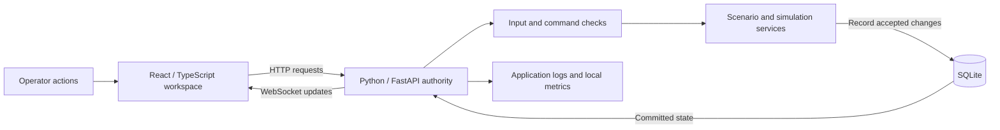

# Explaining Sentinel3 during the review

This guide explains the implemented prototype. It does not establish field performance, sensor accuracy or live aircraft integration.

## Your opening (about 90 seconds)

"Sentinel3 is a prototype command-and-control workspace for one operator to plan, simulate and monitor multiple units. Our hackathon focus is counter-UAS, and the current build demonstrates the software workflow with synthetic scenarios and supplied simulation data.

"The browser is the operator's workspace: maps, entity details, planning and analysis. The Python backend owns the mission state and validates requests. A local SQLite database preserves commands, results and observations. The browser receives updates from that recorded state, so opening more views does not create more independent versions of the mission.

"I'll show the main workflow first, then the logs and tests behind it, and then a modified input dataset. I'll also point out the limits we measured, particularly when a large batch delays interactive updates."

Managing dozens of simulated units is a demonstrated capability. A measured improvement in human operator workload, real aircraft control and field effectiveness would require separate trials.

## The five-minute explanation

1. **You ask for an action in the browser.** The browser submits a request with an identity. A button press is a request, not proof the action completed.
2. **The backend checks it.** It checks data structure, mission state, control requirements and the supported operation.
3. **The application records the result.** Relevant state, receipts and checkpoints are committed together. A failed transaction is rolled back.
4. **The backend publishes the committed picture.** The browser receives a snapshot when connecting, then changes over a WebSocket.
5. **The views share that picture.** Maps and Details use the same mission state and selection; their cameras remain independent.

There are two simulation paths: interactive scenarios created in Orchestrator, and external JSON batches loaded through Simulation. External batch observations do not acquire interactive control authority merely because they appear on the map.

## Decisions you should be able to defend

| Decision | Plain-language reason | Trade-off |
|---|---|---|
| One backend owns mission changes | Every view receives one consistent version of the mission | A long synchronous batch can delay other work in that process |
| Save before publishing | The display should represent something the system actually recorded | Database work adds cost; a recording failure prevents the change |
| Exact request identity and retry | A lost response should not make a repeated button press execute the same intent twice | The client must preserve an uncertain request's exact identity and body |
| Typed, validated contracts | Both sides agree on data shapes; invalid inputs fail at a defined boundary | Changes need compatibility decisions and updated generated contracts |
| SQLite and one local backend | A practical, inspectable deployment for a single operator prototype | This is not a demonstrated multi-user or horizontally scaled deployment |
| Exact geometry checks | Different parts of the system must agree whether an area is valid | Difficult shapes can take longer; the performance report gives measured costs |

The main technologies have specific jobs. **React and TypeScript** build the interactive workspace and check browser-side data types. **FastAPI and Pydantic** expose the Python API and validate its structured inputs. **MapLibre and Cesium** render the 2D and 3D views. **SQLite** stores local durable records. These libraries supply infrastructure; the scenario, ownership, recording/recovery and shared-view logic are Sentinel's application code.

The interactive source uses fixed 200ms simulation steps. Browser rendering is separate: drawing more often does not produce more authoritative observations. An observed object is also distinct from a managed asset; appearing on a map does not by itself make an object controllable. Those boundaries help keep a multi-view workspace consistent.

## A few useful terms

| Term | Meaning here |
|---|---|
| API | The defined requests and responses between the browser and backend |
| WebSocket | The open connection that delivers mission snapshots and updates to the browser |
| Transaction | A group of database changes that commits together or rolls back |
| Idempotent retry | Repeating the same identified request returns its result without repeating its effect |
| Contract | The agreed structure, allowed values and meaning of exchanged data |
| Trace ID | An identifier that connects a request to its diagnostic log lines |

## Questions and grounded answers

**Is this a real drone-control deployment?**

This build is a simulation/development application. Its recorded evidence supports software behaviour on synthetic inputs. Aircraft interfaces, field validation and operational deployment remain separate work.

**Where is the AI?**

The current Suggestions feature uses deterministic rules and explicit operator Apply. There is no live LLM command service in the current architecture. Explain AI-assisted development separately from runtime capabilities.

**What happens if the connection drops after a command?**

The browser retains an uncertain command's identity and body. It can reconcile the receipt or retry that exact request. The backend can return the existing result instead of performing the operation again. A browser test deliberately loses a response after the server handles it.

**What happens if the database fails?**

An uncommitted change is not published as successful. The system retains the last committed picture. For external batches, preparation may already be durable, so an interrupted request can remain pending and needs an exact retry. Do not describe every storage failure as "nothing happened."

**What does a log prove?**

A log describes an instrumented application event. Command acceptance and actual execution completion are distinct. The database's records and receipts are the durable evidence; console logs are diagnostic evidence, and can be lost or rotated.

**Does a disconnected observation mean the object was removed?**

No. Missing inputs remain unobserved; the application does not invent a new measurement. The review datasets and tests demonstrate the specific supported missing-observation behaviour.

**How far does it scale?**

Use the measured workload and report its unit count, timestamp count, geometry and machine. Interactive authoring supports 40 units, including at most 32 controlled actors. A large external contract limit is not a throughput or responsiveness guarantee. Refer to the final performance results for batch delays.

There is one nonterminal interactive run at a time. Stored scenarios and external
batch runs are separate; the prototype is not a demonstrated deployment with
multiple concurrent operators and interactive missions.

**Why aren't large batch delays fixed tonight?**

The measured behaviour is disclosed. Moving work to a separate worker or redesigning persistence would require careful changes to ordering, transactions, recovery and ownership. Those changes are outside this assessment-preparation scope.

**Why can a smaller input take longer than a larger one?**

Row count alone does not describe the work. Each timestamp produces recorded state, including retained observations. Many timestamps with a growing world can require more recording work than a large single snapshot. That is why the performance report measures both the number of observations and the number of timestamps.

"No lost updates" means the committed updates that were actually published arrived in order. It does not mean the interactive source kept its normal update rate while blocked. The pause is a real interruption to responsiveness.

**Can you navigate the code?**

Start at the API boundary, follow the service, then open the test for the behaviour being discussed. You do not need to read every implementation detail aloud.

**How did you use AI tools?**

Be candid that AI coding tools helped implement the system. Describe your own actual work, including the scenarios and product decisions you made. Use the walkthrough to demonstrate what you understand; do not claim you personally wrote or independently reviewed every line.

## Three documented examples of engineering iteration

1. **Geometry failure:** an accepted mixed-scale polygon could fail later with HTTP 500. Shared exact predicates and independent differential tests were introduced; the frozen golden result remained unchanged.
2. **Uncertain requests:** response loss can leave the user unsure whether a command happened. Exact pending-request persistence and retry tests establish how the client recovers.
3. **Simulation UI corrections:** reviews identified misleading finalized-state display, missing editor ABORT confirmation and a stale recorded-command list. Candidate 6 contains corrections and corresponding regression cases.

These are engineering examples. When asked about programme engagement, cite your real demo participation or mentor discussions; this repository alone does not establish attendance.

## Useful code locations

| Start here | What to explain |
|---|---|
| [backend/app/main.py](../../backend/app/main.py) | Service startup, recovery, fixed-step loop, API composition and error handling |
| [backend/app/api/interactive.py](../../backend/app/api/interactive.py) | Browser requests entering interactive controls |
| [backend/app/commands/service.py](../../backend/app/commands/service.py) | Command checks, exact retries, recording and execution lifecycle |
| [backend/app/missions/service.py](../../backend/app/missions/service.py) | Mission ordering, snapshots and publication after recording |
| [backend/app/recording/sqlite_repository.py](../../backend/app/recording/sqlite_repository.py) | Durable records and transactions |
| [backend/app/scenarios/service.py](../../backend/app/scenarios/service.py) | Immutable saved revisions and validation |
| [backend/app/simulation/service.py](../../backend/app/simulation/service.py) | Separate external-batch validation, preparation, completion and retry |
| [frontend/src/app/runtime.ts](../../frontend/src/app/runtime.ts) | Shared mission connection and browser state coordination |
| [backend/tests/test_api.py](../../backend/tests/test_api.py) | API/WebSocket flow and failed-recording assertions |
| [frontend/tests/browser/simulation-compatibility.spec.ts](../../frontend/tests/browser/simulation-compatibility.spec.ts) | Real UI lifecycle, lost response and exact retry |

For deeper detail, use the repository's architecture guide and the final test catalogue. Optional or deferred capabilities must remain labelled as such.
