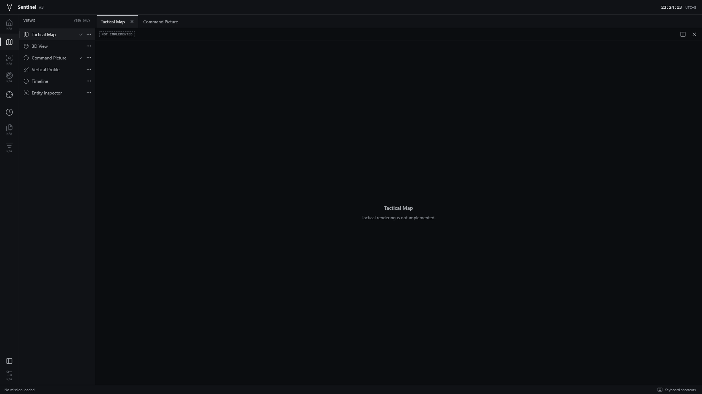
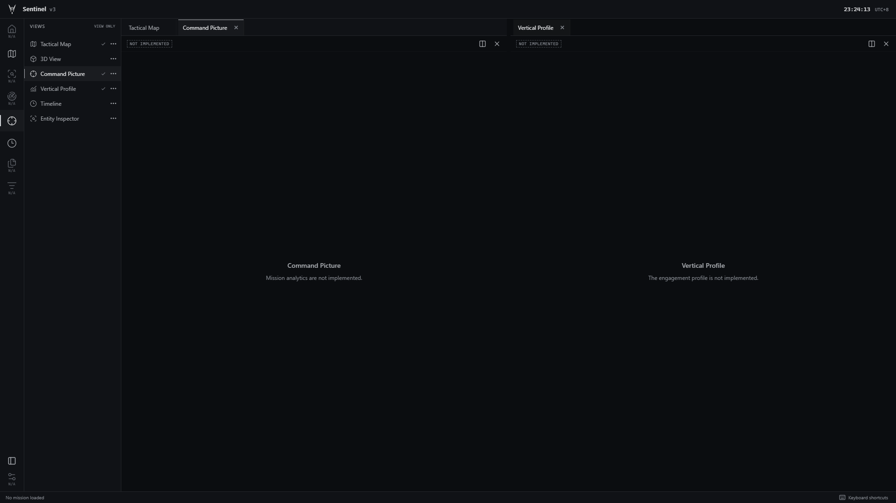
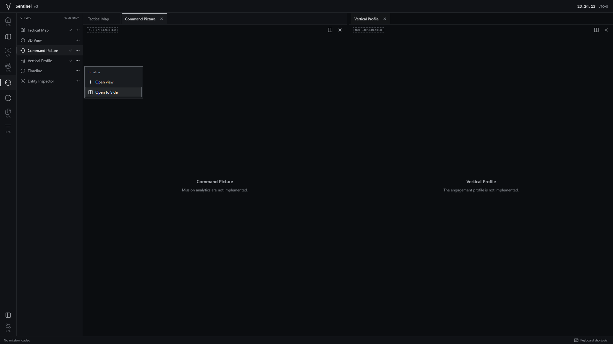

# Sentinel v3 shell visual refinement

Completed 10 September 2026. Scope: appearance, navigation presentation and verification of the existing Phase 1 shell. The two source specifications, implementation plan, backend drafts and domain/simulation contracts are unchanged. No later-phase features or dependencies were added.

## Result

- Replaced mint accents, rounded cards, large headings and repeated explanatory copy with monochrome console chrome, quiet borders, compact tabs and minimal empty-state messages.
- Header contains only the supplied logo, Sentinel v3 and current UTC+8 wall time. Clock state is isolated from workspace, mission and replay state. The supplied PNG is copied byte-for-byte; the header uses CSS compositing against the dark surface.
- Activity Bar contains Home, Map, Tracks, Sensors, Command Picture, Timeline, Reports, Events and Settings. Map, Command Picture and Timeline focus existing shell views. Other modules are disabled, marked N/A and explained on hover. The six existing view placeholders remain available through the Views sidebar, with explicit implementation constraints.
- Retained the single FlexLayout model, derived Zustand workspace metadata, tabs, drag reordering, side placement, keyboard interactions, sidebar visibility, pane lifecycle hooks and isolated shared-context/pop-out harness.
- Ordinary surfaces remain opaque. No fake mission values, map content, provider controls, backend connections or operational states were introduced.

## Independent critique

| Round | Critic | Score | Outcome |
| --- | --- | --- | --- |
| 1 | Separate UI/UX and software critic agent | 8/10 | Stop threshold reached; no second or third design round. |

The critic captured and inspected its own running-browser screenshots and exercised interactions at 1024x768, 1440x900, 1920x1080 and 3840x2160. Its judgment was based on observed visual discipline and usability within the shell scope, not checklist completion. [Full independent critique](round1-critic/REPORT.md).

The critic caught a malformed accessibility-label separator. This nonvisual defect was corrected after critique; the same critic verified fresh browser labels and preserved its original score in an addendum. No aesthetic changes followed the 8/10 decision.

Remaining minor critique findings: constraint labels at 8-9px could be enlarged, and tab/pane close controls duplicate one another. These remain disclosed polish items. N/A has an explicit Not implemented hover explanation. Layout is in memory only. Native pop-out controls remain limited to the verification harness and depend on the opener runtime.

## Verification

- Production and verification Vite builds passed, including TypeScript checking.
- ESLint, Prettier and 5/5 focused workspace unit tests passed.
- 8/8 production browser scenarios passed with no failures or skipped tests. Includes tabs, close/reopen, keyboard navigation/focus, pointer reordering, side placement, divider resizing, isolated synthetic shared context, native pop-out return/reopen, sidebar toggle, unavailable modules and UTC+8 clock semantics.
- Automated accessibility checks found no violations in the selected WCAG A/AA rule set at 1920x1080, 2560x1440 and 3840x2160. This is not a complete accessibility certification.
- Browser evidence and runner report: [verification](verification/browser-results.json). Original Phase 1 evidence was preserved; current tests now write to this refinement directory.
- Initial sandboxed browser execution passed its scenarios but stalled during preview-process cleanup. A rerun with process-cleanup permission completed normally and wrote the report. No product workaround was needed.
- Source specification/plan/contracts/backend diff is empty. Copied logo SHA-256 matches the supplied original: 371c4f1be86d52ccd12073ea71a7d5afe86aa47238446af28c7e8066ae529b79.

## Final screenshots

Captured from the final production build in Edge at 1920x1080; visually inspected after capture. [Capture script](capture-final.mjs).

The score establishes a shell visual baseline only. Maps, backend authority, simulation, mission data, real analytic charts, replay, physical multi-monitor behaviour and operational readiness remain outside this task.
